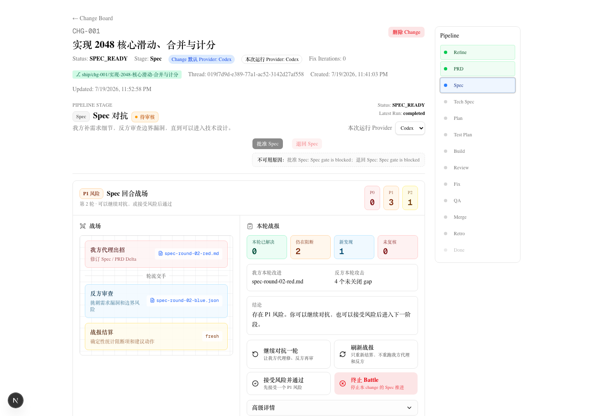

# stagepass

**English** · [简体中文](README.zh-CN.md)

> Take one sentence of intent and walk it through a real software delivery process. Local-first. You approve every gate.
>
> *把一句需求，押着走完一条真正的软件工程流程。本地优先，每一关都由你拍板。*



<p align="center"><em>An adversarial round in the Spec stage: your agent closes gaps, the adversary finds holes, and the battle report is settled deterministically.<br>
While P1 risks remain, the gate refuses to open — keep fighting or accept the risk is your call, not the AI's.</em></p>

---

## Who this is for

**People who want to build with AI but have never been trained as engineers.**

Codex and Claude Code write good code. That isn't the problem. The problem is that if you've never been through a real development process, **you can't tell where the AI is bluffing you** — which requirement is still vague, which acceptance criterion is missing, what landmine that technical approach just buried. All you can do is stare at a wall of generated code and click "looks good."

stagepass does something else: **it doesn't write your code — it makes sure you run the right process.**

You give it one sentence. It walks you and your AI through 12 stages, stopping at every critical junction to wait for your decision. Go through it once and you've actually learned the process — and along the way the AI can't wander off, can't hide, and can be recovered when it crashes.

> Advancing in stages with a human decision point between each one is called **Stage-Gate**, and product organizations have used it for decades. stagepass didn't invent new rules; it just applies them to AI coding. So what you learn is a genuine industry process, not something a tool made up.

---

## How this differs from using Codex / Claude Code directly

With the CLI, what you get is **one AI writing code and then telling you it's done**.

stagepass gives you **a second AI whose only job is to prove the first one wrong** — plus a process in which no party is allowed to grade its own work.

### 1. You are the principal, not a spectator

This isn't marketing copy. It's a hard constraint baked into the prompt (`server/templates/prompts/spec.md`, translated from the Chinese original):

> The red side refers only to the human user — the source of the requirements and the final arbiter.
> You are not the red side. You are our execution agent, serving the red side.
> The opposing side is responsible for interrogation, criticism, and re-review.

The AI that writes the spec (`SPEC_WRITER`) is **your** execution agent. A separate adversary AI (`REQUIREMENT_CRITIC`) exists purely to attack its output. Approval authority lives only with you — the adversary's own prompt spells it out: **"You cannot approve the PRD; locking can only be performed by a human."**

For a beginner this is the whole point. You don't need to be able to spot the holes in your own requirements. **An AI is assigned to point them out to you.** You just decide.

> Naming note: in the Chinese wargame convention used throughout the code and UI, 红方 ("red side") is *your* side — you, the principal — and the adversary is the opposing side. This is the reverse of the Western security convention where red team means the attacker.

### 2. Specs have to survive an adversarial fight — 3 rounds by default

The Spec stage isn't "the AI writes a spec, next." It's fought round by round (3 by default, configurable 1–5):

- `SPEC_WRITER` produces a PRD delta and declares, for each gap raised last round, that it has been fixed.
- `REQUIREMENT_CRITIC` **must re-review the old gaps before it is allowed to raise new ones**, giving a verdict on each (resolved / still open / downgraded / needs human decision), and only then reports newly discovered requirement gaps.

Gaps come in three severities, and the rules are hard: **P0 blocks and cannot be waived**; **P1 blocks, but you may waive it manually**; **P2 doesn't block, but it must be put in front of you.**

Before all of this there's a **PRD Briefing** round: the adversary AI interrogates your requirement itself and issues up to 7 "challenge cards" (critical / important / optional). Questions you defer don't disappear — they must be written into the "human gate" section of the PRD delta. **Silently dropping them is not allowed.**

### 3. No AI grades its own work

- **Battle reports are computed, not written by an AI.** The Spec reports (`spec-report.md` / `war-report.md`) are generated by deterministic code from the adversarial record in the database — not an AI writing "I think I did well."
- **A stale report blocks approval.** Report freshness is judged by a hash of its source data. If the source data changes, the report becomes `stale` and the approve button goes dead.
- **Old problems are assumed to still be live.** The hard rule in Review is `prior blocker remains authoritative` — if last round's blocker wasn't explicitly re-reviewed, it is still open by default. An AI can't get away with "forgetting" to mention it.

### 4. The gates protect against your slip-ups too, not just the AI's

On every approval, the server compares the contract snapshot your page was rendered from against a fresh recomputation from the database (`server/services/preflight-service.ts`):

| Check | Error on drift | What it prevents |
|---|---|---|
| `gateVersion` | `gate_version_drift` | The gate verdict was recomputed after your page loaded |
| `sourceDbHash` | `source_db_hash_drift` | The DB data the verdict rests on has changed |
| git `HEAD` | `git_head_drift` | The repository HEAD moved after the page was rendered |

In other words: **you cannot approve based on a stale screen.** Leave the page open for an hour while background state moves on, and your click gets blocked rather than silently executing against the old state.

### 5. Build never touches your working tree

During Build the AI doesn't write files in your repository. It works in a sibling directory:

```text
<parent of your repo>/.stagepass-workspaces/<repo name>/<changeId>/build-<n>/
```

An isolated branch is created with `git worktree add` from a pinned baseline, and the result flows back as a patch. Your main checkout is never touched. Symlinks are refused at the path layer and escapes are checked with a double `realpath`, so even a runaway build stays inside the isolation zone.

### 6. Two engines, genuinely equal — and both crash-recoverable

Codex CLI and Claude Code are **both real locally spawned processes**. Both are required to yield a real pid (if they can't, they kill themselves and report an error), both are written into the same process table, and both go through the same recovery sweep. There are no second-class citizens — this was deliberate, and the reason is preserved in a code comment:

> Codex previously used `@openai/codex-sdk`, which sealed the child process away (no pid exposed, only an AbortSignal). Spawning it ourselves is the only way to get a real pid, identity, and signal control — so codex and claude share one lifecycle and recovery mechanism instead of codex being the second-class citizen with `pid === null`.

Crash recovery is handled by the pipeline worker's periodic sweep (every 15s by default): a heartbeat older than 45s is treated as lost, the pid is probed, and if necessary SIGTERM → SIGKILL follows — **with process ownership and identity re-confirmed immediately before termination**. The run/job is then marked failed and the provider orphaned. Kill the AI process, close the terminal, reboot the machine: business state converges on its own.

### 7. The database is the referee; files are only mirrors

SQLite is the single source of business authority. The JSON and Markdown under `.ship/` are mirrors and audit material for you and the AI to read. **When they disagree with the database, the database wins.**

---

## 12 stages · 4 formal gates

```text
Refine → PRD → Spec → Tech Spec → Plan → Test Plan
       → Build → Review → Fix → QA → Merge → Retro
```

| Stage | What the AI produces | What you do |
|---|---|---|
| **Refine** | — (you describe the requirement yourself) | Say what you want, in plain language |
| **PRD** | Follow-up questions → draft → final review; briefing-room interrogation | 🚦 **Intake Gate**: approve the PRD / send it back |
| **Spec** | Adversarial rounds producing a PRD delta + gap list | 🚦 **Spec Gate**: approve / reject / fight another round / waive a P1 |
| **Tech Spec** | Technical design delta | 🚦 **Tech Spec Gate**: approve / send back |
| **Plan** | Battle plan: which files are expected to change, which are off-limits, how many steps | Approve the battle plan |
| **Test Plan** | Test cases | Confirm the test plan |
| **Build** | Writes code inside an isolated worktree | Absorb this build / reject this build |
| **Review** | P0 / P1 / P2 findings; P0 and P1 must come with a required fix | Read the findings, decide whether to proceed |
| **Fix** | Fixes the blockers | Same as above |
| **QA** | QA record | Same as above |
| **Merge** | Readiness checks (QA / Review / Docs / Requirements) | 🚦 **Merge Gate**: approve merge / send back |
| **Retro** | Release note + retrospective | Accept |

**Sending work back comes in two flavours:**

- **Rework (redo this stage)** is available only in the document-producing stages — **Refine / Plan / Test Plan / Build / Fix** (plus the internal `Implement` and `Check` execution states).
- **Intake / Spec / Tech Spec / Review / Merge / Retro have no rework path.** To go back you use the gate's reject button, which rolls the state back to the previous checkpoint.

---

## Requirements

| Dependency | Requirement |
|---|---|
| Node.js | ≥ 20 (developed on 25) |
| pnpm | Installed (`npm i -g pnpm`) |
| Port | `3000` free |
| **OpenAI Codex CLI** | Install and sign in yourself; this is the default engine |
| **Claude Code** | Installed with the `@anthropic-ai/claude-code` dependency; you only need to configure auth (`ANTHROPIC_API_KEY` or `claude` login) |

> **At least one** of the two engines must be available. You pick which one to use per item when creating a project.

---

## Quick start

```bash
git clone https://github.com/PenceZHR/stagepass.git && cd stagepass
pnpm install
pnpm dev            # starts Next + the pipeline worker (runs db migrations automatically)
```

Open <http://localhost:3000> → go to **/projects** → **New project**:

- **Name**: anything you like
- **Repository path (repoPath)**: the **absolute path to the local repository** you want the pipeline to operate on. The directory must already exist and must **not** already contain a `.ship/` directory.

On creation, stagepass scaffolds a `.ship/` directory inside that repository and uses AI to analyse the codebase and generate baseline documentation.

> **Pointing the project at your own repository path is the only thing you are required to change.** Everything else works out of the box.

You can also register a project through the API (handy for scripting):

```bash
curl -X POST http://localhost:3000/api/projects \
  -H 'Content-Type: application/json' \
  -d '{"name":"my-app","repoPath":"/absolute/path/to/your/repo","gitEnabled":true}'
```

### Don't want to set it up by hand? Paste this to an AI

From **inside the cloned repository**, paste the following to Claude Code (or any coding agent that can run commands):

```text
You are helping me set up and run "stagepass" (a local Next.js control board for an AI development pipeline) on my machine. Work through the steps below, and only stop to ask me if a step actually fails:
1. Confirm Node >= 20 and pnpm are installed (if pnpm is missing, run `npm i -g pnpm`).
2. Run `pnpm install`, then `pnpm db:migrate`.
3. Confirm at least one AI engine CLI is available and signed in:
   - Codex: run `codex --version`; if missing, install and sign in per the OpenAI Codex CLI docs; if it isn't on PATH, tell me to set `export STAGEPASS_CODEX_BIN=<path>`.
   - Claude Code: already installed via the `@anthropic-ai/claude-code` dependency — just confirm auth (`ANTHROPIC_API_KEY` or `claude` login).
4. Confirm port 3000 is free, run `pnpm dev`, and verify that http://localhost:3000/api/health returns {"ok":true}.
5. Tell me to open http://localhost:3000/projects and create a project, setting repoPath to the absolute path of the repository I want to work on.
Report clearly what you did and what I still need to do by hand (for example, signing in to a CLI).
```

---

## How to use it

1. **Create a project** → point it at your local repository and wait for the baseline to be generated.
2. **Create a Change** (one change = one pipeline run).
3. **Refine**: describe what you want in plain language. No AI action here — this step is you talking.
4. **PRD**: the AI asks follow-up questions and writes a draft; the briefing-room adversary interrogates your requirement (up to 7 challenge cards). Read it → pass the **Intake Gate**.
5. **Spec**: 3 adversarial rounds by default. Read the gap list: P0 must be resolved, P1 you may waive, P2 you must at least look at. Not satisfied? Click "fight another round." Satisfied → pass the **Spec Gate**.
6. **Tech Spec → Plan → Test Plan**: technical design, battle plan (which files are expected to change and which are off-limits), test cases. Confirm each in turn.
7. **Build**: the AI works in an isolated worktree. You can absorb the result or reject this build.
8. **Review → Fix → QA**: findings are graded P0/P1/P2, and blockers must be cleared to proceed.
9. **Merge Gate**: readiness checks must be fully green before it opens.
10. **Retro**: take the release note and the retrospective.

At every stage, **the produced files are clickable** — changed files, plans, Spec battle reports, review findings. Open them and read the contents inline instead of hunting through directories.

---

## Configuration

Every setting is an **optional** environment variable; the defaults work out of the box. Export what you need before starting (both Next and the worker inherit your shell environment) — see [`.env.example`](.env.example):

| Variable | Default | Purpose |
|---|---|---|
| `STAGEPASS_CODEX_BIN` | `codex` (via PATH) | Path to the codex binary (only needed if it isn't on PATH) |
| `ANTHROPIC_API_KEY` | none | Claude Code auth (or use `claude` login instead) |
| `STAGEPASS_DB_PATH` | `server/db/ship.db` | Location of the local SQLite business database |
| `STAGEPASS_LOG_DIR` | default log directory in the repo | Log directory |
| `PIPELINE_WORKER_RECOVERY_SWEEP_MS` | `15000` | Crash-recovery sweep interval |

Export them all at once:

```bash
cp .env.example .env      # fill in what you need
set -a && source .env && set +a && pnpm dev
```

> There are more `STAGEPASS_*` timeout and internal knobs (see the code). You normally shouldn't need to touch them.

---

## Common commands

```bash
pnpm dev              # development: Next + pipeline worker (with automatic migrations)
pnpm build            # production build
pnpm test             # unit tests
pnpm test:acceptance  # heavyweight acceptance tests (starts real services/processes)
pnpm lint             # ESLint
```

---

## Layout and documentation

- `app/` — Next frontend + API routes
- `server/` — service layer, SQLite + Drizzle schema, pipeline execution, AI engine adapters
- `server/templates/prompts/` — prompt templates for each stage and for both sides of the adversarial rounds
- `scripts/` — dev supervisor / pipeline worker / migration scripts
- Architecture and per-file notes live in [`docs/ship/`](docs/ship/) (`architecture.md` · `file-guide.md` · `tech-stack.md`)

---

## Local files (don't commit these)

- The runtime SQLite database lives at `server/db/ship.db` (its `-wal` / `-shm` sidecars are ignored too). Never commit `dev.db`, `server/db/db.sqlite`, or `server/db/ship.db*`.
- The Build isolation zone is `.stagepass-workspaces/`, a sibling of the repository, and is not under version control.
- Don't commit scratch screenshots: `tmp-review-*.png`, `tmp-user-flow-*.png`, `tmp-spec-battle-*.png`.
- Generated artifacts and local runtime state stay out of git unless deliberately promoted to project documentation.

---

## License

[MIT](LICENSE)
