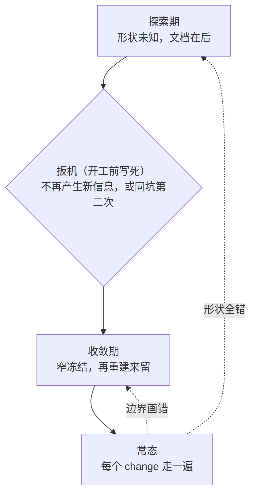
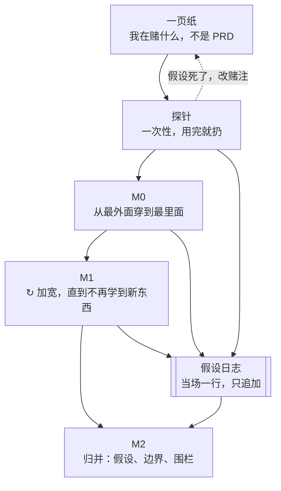
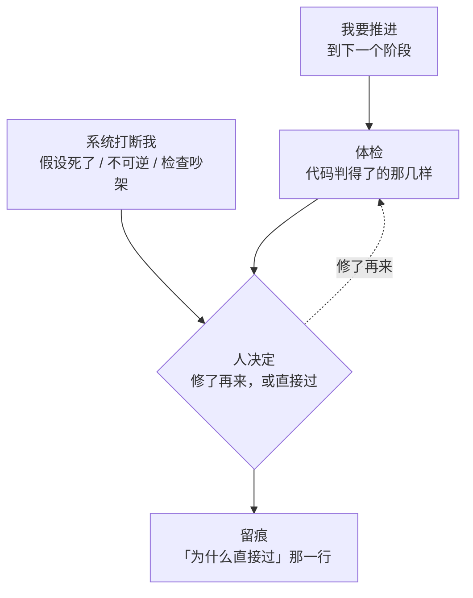

# ARCH · 方法论 —— AI 时代的一人项目

> 2026-08-19。**这份不是软件架构，是工作方法的架构。**
>
> 起因：两个月、四次转向之后，确认旧那套（PRD→Spec→Plan→Build→QA）
> 对一个人不成立。它解决的问题你没有，它不解决的问题你全有。
>
> 它管的范围：怎么开一个项目、什么时候写文档、什么时候冻架构、
> 什么该记下来、系统在什么时刻打断我。
> 它不管：StagePass 本身长什么样（那是 `PRD-stagepass-2026-08-19.md`）。

---

## 〇、这份文档自己的验收判据

> **第五次转向的成本，要显著低于第一次。**

如果这套东西在起作用，转向应该越来越便宜——边界冻得对、外部行为有围栏、
学到的东西留住了。如果第五次跟第一次一样疼，那说明它目前只是一段描述，
还没变成机制。**到那时候打回这一份，不要打补丁。**

---

## 一、地基：两个不对称

### 1.1 生成免费，验证不免费

写代码在变免费，写测试也在变免费。验证不会同速变便宜，因为它被两件事卡住：
**必须真的跑一次**，和**必须有人知道「对」是什么意思**。

推论：旧流程的每一个阶段都有同一个理由——实现很贵，别浪费它。
这个理由整体失效了。新流程要围绕**制造并留住判断**组织，不是围绕别浪费实现。

### 1.2 你是一个人：没有空间传递，只有时间传递

企业流程里每一份文档都是一次**跨人传递**。PM 写 PRD 因为工程师没参加客户会议；
Spec 存在因为实现者不是设计者；QA 存在因为建造者看不见自己的盲区。

你一个人，这些问题**全部消失**——但有一个没消失，而且变严重了：**跨时间传递**。
两个月前的你和今天的你不共享上下文；而真正建造它的那个模型**什么都不记得**。

| | 跨人传递 | 跨时间传递 |
|---|---|---|
| 读者能问作者吗 | 不能 | 能（就是你） |
| 所以要 | 完整、正式、无歧义 | **便宜到肯写、找得到** |
| 写多了的代价 | 低 | **高 —— 吃掉唯一的稀缺品** |

---

## 二、唯一的资源判据：注意力

**token 免费、算力免费、存储免费、代码行数免费、模型的时间免费。
系统里只有一样东西有限：你每天能做的判断次数。**

所以每一个设计决定只按一条评：**这消耗我几次判断？**

- 模型填证据、你只点接受 —— 省
- 十二条判据全推到你眼前 —— 亏。改成只推意外的那两条
- 「直接过」要求写一行理由 —— 值，那一行不可重导
- 为了以后审计而填一个当下没用的字段 —— 亏，且会在第五轮被填成废话

**推论（企业方法论的反面）：默认值优先于流程。**
流程让你每次都走一遍，默认值让你不用走。企业里决策便宜（开会）、实现贵，
所以它用流程；你反过来。**每一个能提前定一次、以后不再想的事，都是省下的注意力。**

---

## 三、只写不可重导的

未来的你自己推得出来的东西，**不要写**。代码怎么工作、接口什么形状、
模块怎么分 —— 读一遍或问模型就有，写下来是浪费，而且会过期变成谎话。

不可重导的只有三样：

1. **我当时以为什么，结果错了**
2. **我否掉了什么，为什么否**
3. **我为什么把线画在这里**

加起来一天可能就几行。传统 PRD 里 90% 的内容属于可重导那一类 ——
这就是它在企业里值钱（跨人时不可重导）而对你是纯负担的原因。

> 这一条能塌掉流程重量的大半，而且不需要写任何代码。**最先执行这一条。**

---

## 四、两个尺度 —— 混淆它们是之前所有错误的来源

| | 探索期 | 收敛期 |
|---|---|---|
| 形状 | 未知 | 已知 |
| 文档位置 | **在后**（追认） | **在前**（约束） |
| 主要产物 | 信息 | 系统 |
| 内部结构 | 计划扔掉 | 计划保留 |
| 测试 | 只写外部行为，个位数 | 完整 |
| 八阶段 | **不适用** | 适用（降成体检，见 §7.3） |

**一上来写架构必错，跟能力无关，是信息的时序问题。**
Parnas 1972 给的模块化判据是「按隐藏哪个会变的决定来切」——
而哪些决定会变，只有建造才产生。开工即定架构在信息论上就不成立。

---

## 五、探索期

### 5.1 三小段（按「要拿到什么信息」分，不按功能分）

**M0 · 最窄的一条真路径**（walking skeleton）
不是功能最少，是**穿得最全**：从最外面进，穿到最里面，再出来。就一条，丑得可以。
目的是**一次性暴露所有接缝的存在**。这一步信息密度最高。
跳过它去做功能，会在第三个月才发现某个接缝根本不成立。

**M1 · 沿这条路径加宽，直到不再学到新东西**
主体，最长。每加一点，当场记一行「我原来以为 X，其实是 Y」。

**M2 · 归并成三份产物**
- 死掉的假设清单
- 边界候选（哪些线是真的，哪些是随手画的）
- 外部行为围栏（那几条从外面进出的测试）

> **M2 是归并，不是回忆。**如果 M1 全程没记，M2 写不出来 —— 建造者是模型，
> 它的上下文早被丢掉，你手里只会有一个能跑的系统和一片空白。
> **这是整个流程里唯一「不做就补不回来」的动作。**

### 5.2 转段扳机 —— 开工前定死，不许当场判断

任一触发即转。两条都已经机械化成可读的数，不许用感觉：

- **产出率枯竭** —— 最近 10 条 iteration 只产出 0~1 条新 `LOG.md` 条目，
  且没有任何 `×N` 上升。
  （产出率 = 新增 LOG 条数 ÷ iteration 条数；开始时高，随 MVP 成熟趋近零）
- **同一个坑第二次** —— 某条 LOG 从 `×1` 变成 `×2` 的那一刻。看得见，不用判断。

> **第一次实测的位置，是整个探索期唯一真正重要的调优参数。**
> 它应该在 iteration 1~2，不是 4。`PRD → Spec → Build → 才实测` 是瀑布换了标签：
> 前三条 iteration 在零信息下押注，之后全在为押错的部分买单。
> MVP 期的 PRD/Spec 降成 `BETS.md` 那一页；真的 PRD/Spec 在收敛期追认。

**M2 不能跳。**收敛期第一个动作是窄冻结，它的输入就是 M2 的产物 ——
排序后的 LOG 前十条 + `BOUNDARIES.md` 里改过三次以上的那几条。跳过 M2，
八阶段的第一步就没有输入，等于又一次在信息不足时定架构。

> **MVP 阶段的产出物不是代码，是那份排序过的清单。**
> 代码是要扔的，清单是要交的 —— 交给后面流程的不是一个仓库，是一份判据。

**不许用「功能够了」当扳机。**那是产品问题，不是阶段问题，用它你会永远差一个功能。
而 MVP 跑通那一刻，扩展有可见产出、加固没有 —— 这是心理压力，不是判断，
所以扳机必须预先写死。

### 5.3 探索期的约束边界

- **弱约束**：内部结构、文件布局、分层、写法 —— 全部放开，这是重建时的自由度
- **强约束**：只在两处 —— **从外面进出的行为**、**可观测性**。它们是唯一跨得过重建的
- **不做 TDD**：MVP 的内部结构是计划要扔的。给它建围栏，结局只有两种 ——
  舍不得扔了（就地转正），或者扔的时候连围栏一起扔（白写）

---

## 六、收敛期

### 6.1 窄冻结

只冻三件，冻死：

- 谁拥有哪份数据
- 什么跨线
- 错误怎么表达

**其余全部保持流动。**MVP 教给你的是边界在哪，不是内部该怎么设计 ——
而内部设计恰好是重建时最该重新决定的。冻多了，等于把临时决定固化成永久约束。

**冻结集越窄，错的时候越便宜。而你一定会错：冻错的架构比流动的错架构贵得多。**

而且冻结必须是**可执行、可引用**的，不能是散文。否则它不是判据，只是一段愿望。

### 6.2 重建来留

不是重构。把外部行为钉死在那几条从外面进出的测试上，然后**重新生成**。

单步更险、单步更便宜，前提是**围栏先存在**。所以两段的准确说法是：

> **先建来学，再建来留。**

### 6.3 之后的常态

每个 Change 是收敛期的缩小版。**这时候、也只有这时候，文档在前是对的**，
因为形状已知。八阶段在这里成立（但仍然是体检，不是许可，见 §7.3）。

---

## 七、四个机制 —— 这部分才是「架构」

流程是走的路，机制是让路成立的东西。一个人干全部角色，缺的正是这四样。

### 7.1 假设日志 —— 唯一补不回来的

其他都能事后补，这个不能。

**现状：已经在做，它叫 `docs/HANDOFF-*.md` 加那五十来条记忆。**
要改的只有一点：**从阶段末尾的总结，改成当场的一行。**
总结是回忆，而回忆是空的。

形态要求：只追加、一行就够、不整理、不要求格式。**贵一点就不会写，不写就等于没有。**

### 7.2 制造独立性 —— 替代角色分离

企业里 PM 质疑工程、QA 质疑开发、评审质疑作者 —— 独立性是**分工白送的**。
你没有分工，必须自己造。

造法按收益排序（这是可花钱的地方，别乱花）：

```
换采样      ≈ 0
换模型      少 —— 训练数据重叠
换上下文    真有用，而且便宜   ← 主力
换证据模态  高 —— 读代码 / 跑一遍 / 看屏幕 / 查网络轨迹
换时间      最高 —— 明天、干净机器、更新过的依赖上还成不成立
```

**「换上下文」的落地就是三作者模型**（代码 / 人 / 模型，模型只填证据不填判决）。
它不是一个功能，**它是替代角色分离的那个东西** —— 全系统最重要的一条。

它做对的关键是做成**类型**而不是规范：代码预铺格子，模型只填空。
没有裁决字段，模型就渲染不出裁决。用提示词要求模型克制是在跟训练目标对抗；
抽掉字段是零成本的。

### 7.3 事件驱动的打断 —— 替代阶段闸门

**不在固定阶段边界拦人。**在四类事件上出现：

1. 一条假设刚被证伪
2. 两个独立检查吵起来了
3. 下一步不可逆
4. 正在做一个会关掉其他选项的决定

这四类是人的判断真正有杠杆的时刻。**阶段边界只是它们的坏代理。**

呈现规则：**按意外程度排序，不按清单顺序。**
「这两个引用断了」值得报；「第 7 条判据模型填了」不值得报 —— 那本来就该发生。

### 7.4 默认值 —— 替代流程

见 §2。凡是能提前定一次的，就定死，写进默认值，以后不再问。
**流程的每一步都在收注意力的税；默认值免税。**

---

## 八、废掉的东西，和理由（防止重新捡起来）

| 废掉 | 换成 | 理由 |
|---|---|---|
| 阶段作为**许可闸门** | 阶段作为**体检**（linter，非门卫） | 跟三作者模型直接矛盾：闸门让代码的判断凌驾于人；何况已无执行通道，本来也拦不住 |
| 无人值守 | 人是执行器 | 跟「每轮我都要知情」互为否定。删掉它不是失去能力，是消掉矛盾 |
| MVP 阶段做 TDD | 只写个位数外部行为测试 | 给计划要扔的东西建围栏 |
| 「功能够了」当转段判据 | 「不再产生新信息」 | 前者是感觉，且在势头下必然失效 |
| 一上来写架构 | M2 之后写窄冻结集 | 信息时序上不成立，跟能力无关 |
| PRD/Spec/Plan 三连在前 | 探索期在后（追认） | 在信息最贫乏的时刻产出三份互相继承错误的文档 |

**保留的**：`src/domain/` 判据层（只降语义，不删）；阶段作为**词汇表**；
阶段作为**陈旧性依赖图**（上游动了，下游结论自动变可疑 —— 这个用途不可替代，
而且人自己算不出来，代码算得出来）。

---

## 九、五种死法，和解药

| 死法 | 症状 | 解药 |
|---|---|---|
| **因弃用而死** | 没有 bug、测试全绿，只是有一天不再打开它 | 靠**即时回报**活着（这一轮问对了问题），审计留存是免费副产品，不是卖点 |
| **橡皮图章** | 十二条全推给人，第五轮开始不看就点 | 按意外排序；系统必须为每一次打断付费 |
| **喂假数据** | 一切看起来正常，直到那些废话变成唯一的记录 | **代价对称**：绕过要便宜、但留痕。绕过比修更贵，人就会去骗检查 |
| **学习蒸发** | 拿到一个能跑的系统，对它一无所知 | 当场记一行（§7.1）。**AI 时代唯一全新的失败方式** |
| **MVP 就地转正** | 临时结构变成两年的地基 | 扳机预先写死（§5.2） |

> 第四条值得单独说：所有旧方法论都默认「谁建的谁就懂了」。这个默认在整个软件史上
> 从未失效，所以从来没人写下来。**现在它失效了。**这是唯一一条必须新增的纪律，
> 其余全是旧建议终于付得起了。

---

## 十、现在在哪，下一步

**位置：M1 末尾 / M2 开头。**有跑得动的东西、四次转向的教训，正在试图写正式的那份。

**一个自我评价的修正**：不是「思路有大问题」。看实际行为 —— 反复建、反复扔、
四次转向、删掉 2298 行 —— **这就是 MVP 阶段的行为，一直在做 MVP。**
问题是以为自己在做别的事，于是付了 MVP 的全部代价，没拿到它的收益：
扔东西时痛、学习没系统打捞、没有扳机、每次转向像失败而不像进展。

**要改的主要是名字。改完之后那三个机制立刻可用，而且都很便宜。**

### 下一步三个动作（都不需要写代码）

1. **把「我在做 MVP」标出来** —— 名字改了，扔才不痛，扳机才装得上
2. **HANDOFF 从阶段总结改成当场一行** —— 唯一补不回来的那个
3. **八阶段从许可降成体检** —— 它在收敛期仍然对，只是不该有否决权

### M2 的实际工作量

比看起来便宜：那二十多份 `HANDOFF-*.md` 加五十来条记忆，本身就是坑的清单，
按时间写的、当场写的、带着「我原来以为」的。**M2 主要是把它们横过来 ——
从按时间，变成按主题的三份产物。**大概一到两个工作日，不是考古。

那个「不做就补不回来」的动作，**没漏**。

---

## 附 · 三张图

> 正文是判据，这三张是形状。改流程时先改图，图改不动说明判据没想清楚。

### 图 1 · 总览：两段 + 扳机 + 两条回退



**整张图只有扳机是硬的。**它必须在开工前写死 —— 到了那一刻你正处在
「跑通了、想继续加功能」的势头里，当场判断必然判错。

`常态 → 收敛期` 那条线**就是「转向」**。两个月走了四次。
**这条线上第五次的成本要显著低于第一次 —— 那是 §0 的验收判据。**
`常态 → 探索期` 应该很少走；如果它常走，说明扳机扣早了。

### 图 2 · 探索期内部



**指向假设日志的那三条是全图最重要的。**它们不发生，M2 就是空的 ——
建造者是模型，上下文早被丢掉，阶段末尾回忆不出来。

M2 是探索期唯一留下的东西，它的三份产物就是收敛期「窄冻结」的全部输入。

### 图 3 · 常态里的一个 change



三件事按这张图读：

1. **体检没有否决权。**它只把代码判得了的推到眼前，按意外程度排序。
   判决在「人决定」那个菱形里，而且只在那里。
2. **两个入口。**左边是我主动推进；右边才是反馈 ——
   **系统在事件上找人，不在阶段边界拦人。**
3. **「直接过」和「修了再来」的代价必须对称。**绕过更贵，人就不会去修，
   人会去骗体检 —— 而那些废话会变成半年后唯一的记录。

`留痕` 那个框是全图最值钱的输出，尽管它看起来最不像功能。
