# 交接：全 Stage Codex App 卡片闭环与 Web UI 收敛（2026-07-26）

> 当前分支：`codex/abstract-cloud-sea-ui`
>
> 当前 HEAD：`f180130`
>
> 演示页面：`http://localhost:3000/projects/PRJ-004/changes/CHG-006`
>
> 相关设计：`docs/superpowers/specs/2026-07-26-codex-native-stage-ui-design.md`
>
> 实施计划：`docs/superpowers/plans/2026-07-26-all-stage-question-batches.md`

---

## 一、交接结论

本轮已经把 StagePass 的 12 个标准阶段统一改造成同一套 Codex-native 工作方式：

1. StagePass Web 的三列总布局不变。
2. Web 不再承载大模型能够完成的提问、选择、编辑、执行和修订。
3. 每个阶段都在 **Codex App 内真实可见的持久任务**中运行，不能只在后台运行。
4. 每批展示 1–10 个具体阻塞问题，每题提供 A/B/C 风格选项。
5. 用户必须逐题选择；提交后后端记录精确的“问题 → 选择”映射。
6. 后端必须在同一个 Codex 任务中启动后续 turn。
7. 仍有阻塞问题就继续下一批；没有阻塞问题后才允许输出正式阶段结果。

代码、定向测试、类型检查、页面结构和运行态健康检查已经完成。

**尚未完成的最终验收**是：使用本轮代码重新运行一个阶段，亲眼确认新 Codex 任务出卡、提交成功，并在同一任务中继续运行。旧任务不会自动加载本轮新增的 prompt 规则，因此不能用旧任务代替这项验收。

---

## 二、不可退化的产品要求

后续改动必须同时满足以下条件：

- 任务必须出现在 Codex App 的任务列表中，并能在 Codex App 中看到实际运行。
- 网页点击阶段开始后，不能只创建后台 job。
- 问题必须是当前阶段的具体决策，不能只问“目标用户、范围、验收标准”等分类名称。
- 每批最少 1 题、最多 10 题。
- 每题提供 2–8 个明确选项，通常使用 A/B/C。
- 一批中的所有问题都回答后才能提交。
- 提交成功必须以 StagePass 后端持久化成功为准，不能只显示本地前端成功。
- 提交后必须回到原 Codex `threadId`，不能创建一个用户看不到的后台会话。
- Codex 收到以 `STAGEPASS_SELECTION_CONFIRMED` 开头的确认消息后，才能认为选择已经生效。
- 已回答的问题不得重复询问。
- 仍有执行阻塞项时继续下一批；没有阻塞项后才产出正式阶段结果。
- StagePass Web 不得重新出现与 Codex 重复的决策表单或执行工作台。
- 三列页面总结构不得因为阶段工作区收敛而改变。

任何一条不满足，都不能称为端到端闭环成功。

---

## 三、阶段覆盖

统一策略源覆盖以下 12 个标准阶段，并兼容当前后端使用的持久化 phase 名称：

| 标准阶段 | 已映射的 phase/别名 | 需要收敛的核心问题 |
| --- | --- | --- |
| PRD | `PRD`、`Intake`、`prd_briefing_*` | 用户、结果、范围、验收 |
| Spec | `Spec`、`spec_critic`、`spec_verdict` | 精确行为、边界、错误、兼容 |
| Tech Spec | `TechSpec`、`tech_spec` | 接口、数据、并发、迁移、安全 |
| Plan | `Plan`、`generate_plan` | 顺序、依赖、回滚、验证 |
| Test Plan | `TestPlan`、`test_plan` | 关键路径、环境、数据、判据 |
| Build | `Build`、`Implement`、`implement` | 无法从批准文档推导的施工取舍 |
| Review | `Review`、`review` | finding 严重度、修复、豁免 |
| Fix | `Fix`、`fix_findings` | 修复策略、兼容、回归边界 |
| QA | `QA`、`Check`、`local_check` | 验证环境、范围、失败判据、剩余风险 |
| Merge | `Merge`、`release` | 合并、发布、回滚、授权 |
| Retro | `Retro`、`retro` | 结论、责任人、后续行动 |
| Done | `Done`、`delivery` | 运行方式、交付范围、文件地图、限制 |

未知 phase 会进入 `generic` 安全策略，仍然要求最多 10 个具体阻塞问题并在收敛后才能输出，不会静默跳过卡片规则。

---

## 四、当前架构

```mermaid
flowchart LR
    Web["StagePass Web<br/>开始或重新运行阶段"]
    Action["Pipeline action / job"]
    Policy["阶段策略注册表<br/>phase → clarification policy"]
    Binding["持久 Codex thread binding"]
    Task["Codex App 可见任务"]
    Card["present_stagepass_choices<br/>1–10 题"]
    Receipt["choice-receipt/v2"]
    Persist["DB event + interaction<br/>command receipt + outbox"]
    Continue["同 thread follower turn<br/>STAGEPASS_SELECTION_CONFIRMED"]
    Result{"仍有阻塞？"}
    Output["正式阶段结果"]

    Web --> Action
    Action --> Policy
    Policy --> Binding
    Binding --> Task
    Task --> Card
    Card --> Receipt
    Receipt --> Persist
    Persist --> Continue
    Continue --> Result
    Result -->|有| Card
    Result -->|无| Output
```



### 关键身份约束

每次卡片调用都携带并校验以下不可变字段：

- `logicalTurnId`
- `projectId`
- `changeId`
- `threadId`

后端会拒绝 thread 不匹配、scope 不匹配、logical turn 不存在以及幂等键冲突的提交。这样可以避免用户在一个 Codex 任务里勾选，答案却被写入另一个 change 或另一个任务。

### 同任务续跑的证明

提交接口返回以下关键字段：

- `continuationConfirmed`
- `continuationThreadId`
- `continuationTurnId`
- `continuationErrorCode`

只有 `continuationConfirmed=true`，并且 `continuationThreadId` 等于原 `threadId`，才能证明答案已经触发原 Codex 任务的后续 turn。接口最多等待 45 秒观察 follower start；未观察到时返回明确错误，而不是假报成功。

---

## 五、前端改造

### 页面边界

`app/projects/[id]/changes/[changeId]/page.tsx` 现在统一挂载：

- 一个 `PipelinePageShell`
- 一个 `PhaseStageShell`
- 一个 `StageCodexWorkspace`
- 一个 `CodexTaskControl`

PRD、Spec、Tech Spec、Plan、Test Plan、Build、Review、Fix、QA、Merge、Retro、Done 不再分别挂载 Web 决策工作台。

### 每个阶段保留的内容

- 阶段名称、说明和状态
- 事实型 blocker
- 只读 artifact、run 和 event
- “每批最多 10 个具体问题，逐题选择”的流程说明
- Codex App 连接状态
- 开始、重新运行或打开 Codex 的桥接按钮

### 按钮语义

| 状态 | Web 按钮 | 含义 |
| --- | --- | --- |
| 当前阶段无绑定任务 | `开始本阶段` | 创建并启动当前阶段的 Codex 可见任务 |
| 当前阶段已有绑定任务 | `打开 Codex` / `查看 Codex 运行` / `去 Codex 选择` | 打开已有任务，不注入新 prompt |
| 当前阶段已有绑定任务且允许重跑 | `重新运行本阶段` | 创建新的阶段运行并加载当前策略 |
| 未来阶段 | 最多显示 `打开 Codex` | 只读，不允许提前执行 |

重要：验证本轮改造时必须点击 **`重新运行本阶段`**。只点击 `打开 Codex` 会打开旧任务，旧任务不会获得本轮新增的阶段策略。

---

## 六、后端与卡片协议

### 阶段策略

`lib/stage-clarification-policy.ts` 是前后端共享的唯一事实来源，定义：

- 12 个标准阶段及顺序
- phase aliases
- 阶段目标
- Web 只读摘要
- 收敛规则
- 每批上限 10 题
- 用于约束问题具体程度的示例

示例问题只是具体度参考，不是固定问卷。Codex 应先阅读已有 artifact 和仓库事实，只询问无法安全推导且会阻止正确执行的决定。

### Prompt 注入

`server/services/codex-desktop-run-context.ts` 根据持久化 phase 解析策略，并要求 Codex：

- 使用 `present_stagepass_choices`，而不是纯文本提问；
- 每批提出 1–10 个具体问题；
- 每题提供 A/B/C 风格选择；
- 等待 `STAGEPASS_SELECTION_CONFIRMED`；
- 在同一 Codex 任务中整理答案；
- 重新评估阻塞项；
- 不重复已回答问题；
- 收敛前不得输出正式阶段结果。

`server/services/codex-desktop-engine.ts` 负责把 `logical.phase` 和任务身份传入 run context。

### 卡片提交

插件使用 `stagepass.choice-receipt/v2` 向：

`POST /api/codex/card-choice-receipts`

提交一批答案。接口约束：

- 只接受 JSON；
- 禁止带浏览器 `Origin` 的普通网页直接调用；
- 每批 1–10 题；
- 每题至少选择一个选项；
- question ID 不得重复；
- option ID 与 label 必须一一对应；
- receipt 使用幂等键持久化；
- thread、project、change 和 logical turn 必须一致。

成功记录后，后端创建 `interaction_wakeup` job 和 outbox effect，再通过 Codex Desktop follower 在原 thread 启动 continuation turn。

---

## 七、插件状态

当前安装状态：

```text
stagepass-card@personal
installed, enabled
0.1.0+codex.20260726165006
/Users/zhanghr/plugins/stagepass-card
```

插件开发副本：

```text
.stagepass/plugin-development/stagepass-card/
```

本次全 Stage 改造没有再做一次无意义的插件版本升级，因为当前插件已经是通用 batch v2：

- 工具名：`present_stagepass_choices`
- 支持 1–10 个问题
- 支持每题独立选择
- 提交到 choice receipt v2
- 等待 `STAGEPASS_SELECTION_CONFIRMED`
- 支持在同一任务继续下一批

接手人可以用以下命令复核：

```bash
codex plugin list
node --test .stagepass/plugin-development/stagepass-card/scripts/server.test.mjs
```

如果以后修改插件源码，必须同步开发副本、personal source 和 Codex 安装缓存，不能只改 `.stagepass/plugin-development` 后就认为 Codex App 已加载。

---

## 八、关键文件地图

| 文件 | 职责 |
| --- | --- |
| `lib/stage-clarification-policy.ts` | 12 个阶段共享策略及 alias 解析 |
| `lib/stage-clarification-policy.test.ts` | 阶段覆盖和安全 fallback 合同 |
| `server/services/codex-desktop-run-context.ts` | 向每个 Codex 阶段 turn 注入卡片和收敛规则 |
| `server/services/codex-desktop-run-context.test.ts` | 验证每个 phase 都得到正确策略 |
| `server/services/codex-desktop-engine.ts` | 把持久化 phase 和任务身份传入 run context |
| `app/projects/[id]/changes/[changeId]/stage-codex-workspace.tsx` | 所有阶段共享的只读 Codex 工作区说明 |
| `app/projects/[id]/changes/[changeId]/codex-task-control.tsx` | 开始、重跑、打开可见 Codex 任务 |
| `app/projects/[id]/changes/[changeId]/page.tsx` | 三列总页面和统一阶段装配 |
| `app/api/codex/card-choice-receipts/route.ts` | 卡片提交 v1/v2 的输入校验 |
| `server/services/stagepass-choice-receipt-service.ts` | 身份校验、幂等持久化、续跑控制面 |
| `server/services/host-continuation-delivery.ts` | 在同一 Codex thread 启动 follower turn |
| `server/services/interaction-wakeup-orchestrator.ts` | 把已确认选择转成同任务 continuation |
| `.stagepass/plugin-development/stagepass-card/scripts/server.mjs` | 卡片 MCP App 工具和 UI 服务 |

---

## 九、已完成验证

### 定向测试

最终定向结果为 **67/67 通过**：

- 后端和契约测试：26/26
- 前端和页面边界测试：41/41

覆盖：

- 12 阶段策略注册表
- phase alias 解析
- run context prompt 注入
- shared stage workspace
- Codex 按钮语义
- 三列页面边界
- Build、Fix、Plan 等旧工作台不再挂载

### 静态检查

- `pnpm exec tsc --noEmit`：通过
- 定向 ESLint：通过
- `git diff --check`：通过

### 浏览器检查

在演示 change 上检查过：

- PRD 显示 PRD 专属说明；
- 未来 Spec 显示 Spec 专属说明和只读状态；
- 两者都显示“每批最多 10 个具体问题，逐题选择”；
- 当前已绑定阶段同时显示“打开 Codex”和“重新运行本阶段”；
- 三列总结构保持不变；
- 浏览器控制台没有错误。

### 全仓测试状态

最后一次 `pnpm test`：

```text
2762 tests
2704 pass
58 fail
```

这 58 个失败没有在本任务内完成逐项归因和修复，包含旧 UI source contract、DB 写入清单、迁移幂等、测试枚举和 rollout/provider 合同等。

因此只能声明本次改造的定向范围通过，**不能声明整个仓库测试全绿**。

---

## 十、当前运行态快照

2026-07-26 晚间检查：

- `/api/health`：`ok=true`
- DB：`ok=true`
- worker：`healthy=true`
- worker crash loop：`false`
- `/api/codex/health`：`status=ready`
- shell required capabilities：全部 available
- follower required capabilities：全部 available
- bindings：`ready=1`、`running=0`、`detached=0`
- interactions：`pending=0`、`expired=0`、`failed=0`
- 插件：installed、enabled

但仍有三个诊断信号需要后续确认：

1. `/api/health` 在接口正常响应时仍报告 `supervisor.next.portListening=false`。
2. `/api/codex/health` 的 `mcpHostEvidence.status=missing`。
3. `/api/codex/health` 的 `turnObservation.notYetVisible=1`。

这些信号没有让总体状态退出 `ready`，但说明当前健康检查还不足以单独证明“出卡 → 提交 → 同任务续跑”的完整稳定性。最终必须以活体卡片验收为准。

---

## 十一、最终活体验收步骤

### 1. 确认服务

```bash
pnpm dev
curl --noproxy '*' -fsS http://127.0.0.1:3000/api/health
curl --noproxy '*' -fsS http://127.0.0.1:3000/api/codex/health
codex plugin list
```

预期：

- StagePass 和 DB 为 `ok=true`
- worker 为 `healthy=true`
- Codex 为 `status=ready`
- `stagepass-card@personal` 为 installed、enabled

### 2. 创建加载新策略的阶段运行

打开：

`http://localhost:3000/projects/PRJ-004/changes/CHG-006`

在当前 PRD 阶段点击：

`重新运行本阶段`

不要只点击 `打开 Codex`。

### 3. 验证 Codex App 可见性

必须同时看到：

- Codex App 被打开；
- 任务出现在 Codex App 任务列表中；
- 任务标题与当前 project/change 对应；
- 新 turn 在这个任务中运行；
- 不是只有 StagePass 后台 job 状态变化。

### 4. 验证第一批卡片

预期：

- 出现一张包含 1–10 个问题的 StagePass 卡片；
- 问题是当前小游戏 PRD 的具体问题；
- 不是“目标用户”“验收标准”这样的分类清单；
- 每题有明确 A/B/C 风格选项；
- 未完成全部问题时不能成功提交。

### 5. 验证提交和同任务续跑

完成所有选择并提交后，必须证明：

- StagePass 后端记录 receipt；
- UI 不再显示“选择尚未生效”；
- receipt 返回 `continuationConfirmed=true`；
- `continuationThreadId` 等于原 Codex `threadId`；
- 原任务出现新的 follower turn；
- 新 turn 收到 `STAGEPASS_SELECTION_CONFIRMED`；
- Codex 明确整理本批“问题 → 选择”。

### 6. 验证收敛循环

- 如果仍有阻塞项：原任务继续展示下一批新问题；
- 下一批不得重复已经回答的问题；
- 如果没有阻塞项：停止提问并输出正式 PRD；
- 正式结果必须仍在原 Codex App 任务中可见。

### 7. 横向抽查

PRD 成功后，至少再抽查：

- Tech Spec：应询问接口、并发、迁移等技术阻塞项；
- Build：只询问不能从批准文档和仓库推导的施工取舍；
- Review：询问 finding 处置，不重新问 PRD；
- Merge：询问合并、发布和回滚授权。

最终发布前建议对全部 12 个阶段各跑一次新任务。

---

## 十二、故障定位

### 症状：网页一直显示“Codex App 未连接”

先检查：

```bash
curl --noproxy '*' -fsS http://127.0.0.1:3000/api/codex/health
```

重点看：

- `status`
- `shellCapabilities`
- `followerCapabilities`
- `bindings`
- `followerStartAttempts`

### 症状：Codex 任务打开了，但没有卡片

检查：

- 是否点击了 `重新运行本阶段`，而不是打开旧任务；
- prompt 是否包含 `[stagepass-choice-card:...]`；
- prompt 是否包含正确的 `stageClarificationPolicy=<stage>`；
- Codex 是否能看到 `present_stagepass_choices`；
- `codex plugin list` 中插件是否 enabled。

### 症状：卡片提交显示“选择尚未生效”

检查 `POST /api/codex/card-choice-receipts` 的错误：

- `choice_receipt_logical_turn_not_found`
- `choice_receipt_binding_not_found`
- `choice_receipt_thread_mismatch`
- `choice_receipt_scope_mismatch`
- `choice_receipt_selection_invalid`
- `choice_receipt_idempotency_conflict`
- `choice_receipt_continuation_identity_invalid`

不要把失败改成前端假成功。应修复 logical turn、binding、scope 或 thread 身份链。

### 症状：receipt 已记录，但 Codex 没继续

检查：

- `continuationConfirmed`
- `continuationTurnId`
- `continuationErrorCode`
- `pipeline_command_outbox`
- `pipeline_jobs` 中的 `interaction_wakeup`
- `codex_follower_start_attempts`
- `host-continuation-delivery.ts` 的 identity mismatch/no client 错误

### 症状：提交后开了另一个任务

这是 P0 缺陷。比较：

- 卡片输入的 `threadId`
- binding 的 `threadId`
- receipt 的 `continuationThreadId`
- follower start attempt 的 `threadId`

四者必须相同。

---

## 十三、接手优先级

### P0：完成一次真实卡片闭环验收

记录：

- project/change
- stage
- binding ID
- thread ID
- logical turn ID
- interaction ID
- receipt ID
- continuation turn ID

验收失败时保留这些身份字段，禁止只记录“点了没用”。

### P1：补自动化真实 Codex App E2E

现有测试覆盖合同和页面边界，但仍需要一个真实宿主测试证明：

`网页点击 → 可见任务 → 出卡 → 全部选择 → receipt → 同 thread 新 turn`

### P1：收紧健康状态

调查并处理：

- `supervisor.next.portListening=false`
- `mcpHostEvidence.status=missing`
- `turnObservation.notYetVisible=1`

在这些信号无法解释时，不应把 `ready` 等同于稳定的端到端成功。

### P2：全仓失败归因

对剩余 58 个测试逐类确认：

- 哪些是已经删除的旧 Web UI 合同；
- 哪些是本轮真实回归；
- 哪些是当前脏工作树中的独立改动；
- 哪些测试应更新、修复或删除。

### P2：整理提交

当前工作树包含大量未提交修改，并非只有本交接所列文件。接手人必须：

1. 先看 `git status --short` 和 `git diff`；
2. 不得使用 `git reset --hard` 或覆盖用户改动；
3. 按功能边界拆分提交；
4. 文档、插件、控制面、UI 和测试分别核对后再提交。

---

## 十四、交接完成标准

只有同时满足以下条件，才能把该功能标记为完成：

- [ ] 12 个阶段都解析到正确策略
- [ ] Web 三列总布局未改变
- [ ] Web 不存在重复的阶段决策/执行表单
- [ ] 新阶段运行出现在 Codex App 可见任务中
- [ ] 卡片包含 1–10 个具体问题
- [ ] 每题有明确选项且必须全部回答
- [ ] receipt 被后端持久化
- [ ] `continuationConfirmed=true`
- [ ] continuation 使用原 `threadId`
- [ ] 原任务收到 `STAGEPASS_SELECTION_CONFIRMED`
- [ ] 未收敛时继续下一批且不重复问题
- [ ] 收敛后才输出正式阶段结果
- [ ] 定向测试、类型检查和 lint 通过
- [ ] 剩余全仓测试失败已明确归因
