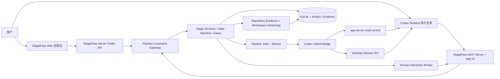
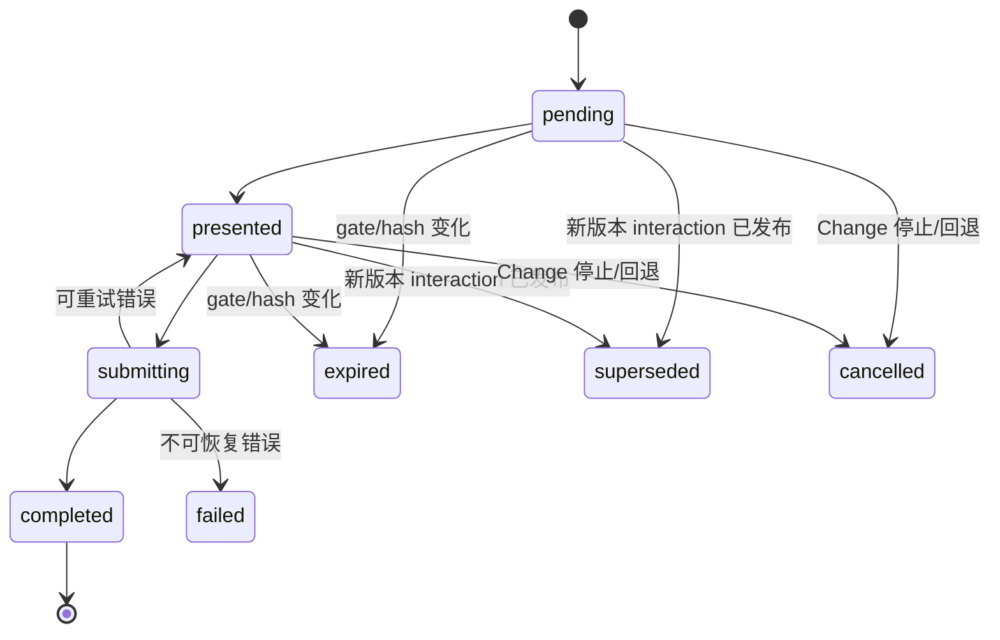

# StagePass Codex 原生总控架构设计规格

**状态：** 待用户批准
**日期：** 2026-07-23
**范围：** 产品定位重基线、Codex Desktop 深度集成、MCP App 人工交互迁移、Web 精简、Git 表面层移除
**决策原则：** 在 Phase 0 可行性闸门通过前，不删除任何现有可用交互入口

---

## 1. 决策摘要

StagePass 将从“在 Web 内完成完整流水线交互并由独立 `codex app-server` 执行”迁移为“StagePass Web 做总控台，Codex 桌面客户端做真实执行与人类决策主界面”的本地产品：

- **StagePass Web** 负责项目与 Change 总览、运行控制、状态、进度、阻塞、证据、模型配置、恢复和“在 Codex 中打开”。
- **Codex app-server shell/read control** 负责以 `thread/start(ephemeral:false)` 创建持久 shell、以 `thread/name/set` 命名、查询/修复 shell，并用 `thread/read { threadId, includeTurns:true }` 只读轮询由 Desktop 启动的 turn 生命周期与终态；它禁止为 StagePass managed run 调用 `turn/start`。
- **Codex Desktop follower** 打开 `codex://threads/<threadId>` 后承载该 shell；Desktop IPC `thread-follower-start-turn` 是启动 StagePass managed turn 的唯一通道，它自身的显式 `no-client-found` 或 success 是唯一 readiness 判据。Desktop 还负责 targeted interrupt，但不存在另一个已验证的 non-mutating readiness probe，也不要求未实测的 lifecycle notification stream。
- **StagePass MCP App** 在该任务中呈现审批、拒绝、补充信息、接受风险、采纳 Build/Fix、QA 与 Merge 等人类交互卡片。
- **StagePass Server** 继续作为唯一业务权威：状态机、阶段门禁、动作契约、幂等、版本/哈希校验、作业租约、执行上下文、人工决策、证据和恢复均由 Server 结算。
- **Git 产品表面** 从 StagePass 移除；用户使用 Codex 自带 Git 体验。StagePass 内部仍保留 Git 作为仓库事实、隔离施工、diff/hash、采纳和 Merge readiness 的证据底座。

该迁移不是给现有 Web 加一个聊天框，也不是在对话内部建立 StagePass 自有聊天系统。目标是让 StagePass 后端驱动 Codex 客户端中真实、持久、可命名、可回看的任务。

---

## 2. 产品定位与非目标

### 2.1 目标产品形态

StagePass 是由四个产品组件构成的本地单用户系统；其中 Bridge 内部明确分成 shell control 与 follower execution 两条 transport：

1. StagePass Server：产品内核和事实权威。
2. StagePass Web：总控台和只读/运维型客户端。
3. Codex Hybrid Bridge：Server 与 app-server shell control、Codex Desktop follower IPC 之间的本地集成边界。
4. StagePass MCP Server + App UI：Codex 任务中的结构化人类交互表面。

### 2.2 目标

- 每个 managed scope 始终映射到一个 Codex Project 下的一个持久任务：Change、Project PRD、Project Context 各自独立且可复用。
- 后端能通过 app-server 创建/命名持久 shell和只读观察 turn，通过 Desktop follower 启动、继续和中断真实 turn。
- 用户在该任务中完成所有业务判断，点击后由 StagePass Server 重新验证并持久化。
- Web 不再复制业务决策编排，只显示 Server 已计算出的状态和可运维操作。
- Web 与 MCP App 调用同一个 Pipeline Command Gateway，不存在“Web 能做、MCP 做不了”的私有路径。
- 迁移后不回退现有的人类最终裁决、证据优先、工作区保护、可追溯和可恢复能力。

### 2.3 非目标

- 不实现通用聊天产品或 StagePass 自有对话历史。
- 不让 MCP App、Codex 模型或 Web 前端成为状态机权威。
- 不允许模型直接调用人工审批提交工具。
- 不支持第二 Provider，也不恢复 Claude 兼容层。
- 不做远程 SaaS、多租户、权限体系、语音或 TUI。
- 不用 MCP 替代 Pipeline worker、Stage authority 或 action contract。
- 不把内部 Git 证据删除，也不把 Codex UI 中“看起来已提交”当作 Merge 事实。
- 不承诺 Codex Desktop 私有 IPC 永久兼容；它必须被能力探测、版本门禁和适配层隔离。
- 不把 Codex 会话内 host-only `codex_app` tool 当作 StagePass Server 可调用的后端能力；后端只依赖已实测的 app-server JSON-RPC、deep link 和 Desktop follower IPC。

---

## 3. 仓库现状证据

本设计以 2026-07-23 当前代码为准，而不是沿用旧需求文档中的历史判断。

### 3.1 已经完成但需求文档仍写成待实施的能力

- `server/types/enums.ts` 的 `AiProvider` 已只有 `"codex"`。
- `server/services/provider-selection-service.ts` 只解析和返回 Codex。
- `changes.codex_thread_id` 已存在于 `server/db/schema.ts`。
- `change_provider_sessions` 已按 `(changeId, provider, sessionKind)` 持久化外部会话。
- `server/services/codex-model-catalog-service.ts` 已能从 app-server 读取模型目录。
- 当前 legacy engine 已把 `AiRunInput.model` 和 `reasoningEffort` 传入 app-server `turn/start`；Hybrid 迁移必须把同一语义改传给 follower start。

因此 `docs/STAGEPASS-ACTUAL-REQUIREMENTS.md` 中“Claude 链路完整在用”“不做 MCP”“只有 Server 和 Web”不再是目标态，必须在迁移第一批文档变更中重基线。

### 3.2 当前实现与已验证的 Hybrid ownership

`server/services/codex-app-server-client.ts` 通过：

```ts
spawn(options.bin, ["app-server"], processOptions)
```

当前生产 engine 为每次 StagePass 执行拉起独立进程。`server/services/codex-app-server-engine.ts` 初始化后调用 `thread/start` 或 `thread/resume`，再调用 app-server `turn/start`，回合完成后 `client.close()`；这一 managed-turn 执行路径必须退役。

2026-07-23 的真实客户端 spike 已证明另一条、也是本方案采用的 Hybrid 路径：

1. app-server `thread/start(ephemeral:false)` 创建持久 shell。
2. app-server `thread/name/set` 指定任务名称。
3. 打开 `codex://threads/<threadId>`，让 Codex Desktop renderer 加载该 shell。
4. deep link 后约 1 秒调用真实 `thread-follower-start-turn` 返回 `no-client-found` 且未创建 turn；继续有界重试该 start 后，约 10 秒时成功并恰好创建一个真实 turn，最终到达 `completed`。
5. 同一 thread 的第二轮仍由 follower IPC 启动并真实 `completed`。
6. 独立后端 app-server 调 `thread/read { threadId, includeTurns:true }` 能完整读取上述两轮，包括 turn id、items、`status=completed`、`startedAt`、`completedAt`、`durationMs` 和 `agentMessage`。

因此“app-server 返回 thread id”本身只证明 shell 已 provision，不证明 managed turn 已由 Desktop 执行；`thread/read(includeTurns:true)` 只证明/观察已存在 turn，也不授权 app-server 启动 turn。权威边界是：**app-server provision shell and observe turns read-only，Desktop follower starts/interrupts turns**。

2026-07-23 的后续目标客户端证据（run `66be53ed-3ecc-4cad-af61-1a7d834502b4`）进一步证明：creator app-server session 内 `thread/start → candidate journal → deep link → name → thread/read/full thread/list` 能确认一个 `ephemeral:false`、正确 cwd/title、零 turns 的 bootstrap shell，但 137 次独立 app-server list 均看不到它。deep link 因而只能记录 `activation_requested`，不能充当持久性或跨客户端可见性证明。目标态必须以一次专用、可恢复、只读 follower materialization turn 让该不可变 candidate 成为 durable shell，再由新的 app-server client 对 exact id/title/cwd/persistent/turn/marker 做 read + 全分页 list 证明。

### 3.3 当前会话映射与全部 AI caller 必须收敛

`server/services/provider-session-service.ts` 支持 `general`、`spec_writer`、`spec_critic`、`build`、`fix` 等 session kind。目标态需要：

- `changes.codexThreadId`：Change 的 canonical persistent shell/thread id，由 app-server provision、由 Desktop follower 执行。
- `change_provider_sessions(provider="codex", session_kind="general")`：同一 canonical id 的兼容/查询索引。
- 阶段专用 session kind 不再创建多个用户可见任务。Spec writer 与 critic 是同一 canonical task 上依次执行的 role-scoped parent turns；Build/Fix 也是该 task 上的顺序 parent turns，并在 StagePass 指定的隔离 worktree cwd 工作。任何阶段 turn 都禁止创建或采用第二个 Projects/Chats 可见 shell。
- critic independence 是输入重建契约，不是技术性上下文隔离：critic prompt 只从冻结 spec artifact、requirements 和 review checklist 重新构造，并包含显式 adversarial fresh-evaluation 指令；不得注入 writer scratch、临时 transcript、私有 reasoning 或未冻结草稿。critic 结果写独立 review artifact/decision。
- 同一 canonical task 的历史可能仍对 follower/model 可见，这是已知边界，不能称为隔离或 fresh context。若未来要求强上下文独立，必须新增客户端能力闸门后再设计，不在本迁移中虚假承诺。
- 旧 app-server thread id 只要控制面能唯一证明其 `ephemeral:false`、repo cwd/标题身份正确，即可升级为 canonical binding；binding provision/repair 不虚构 follower attach probe。既有 `followerStartProvedAt` 只在同一 canonical thread 首次真实 follower start 成功后保留，否则在下一次 managed turn 通过真实 start 重新验证。旧的 ephemeral thread、仅由 app-server `turn/start` 跑过且身份不合格的 thread 只保留审计。

当前 production AI caller 不只存在于 Change pipeline。`server/services/prd-service.ts` 以伪 `changeId="__prd__"` 和 legacy retry thread 执行 Project PRD；`server/services/context-init-service.ts` 以 `${projectId}-context-select|generate` 伪 change id 执行两个 Project Context turns。两者都必须迁移，不能用 synthetic Change、legacy thread 或 caller-generated correlation 绕过 canonical binding/logical turn fence。

最终 production caller inventory 由 TypeScript AST 生成并在测试中锁定。`prd-service.ts`、`context-init-service.ts`、`pipeline-engine-service.ts`、六个 pipeline stage caller 和任何新增 `AiEngineAdapter.run/runStreamed` caller，必须二选一：显式调用 managed owner + logical-turn resolver，只向 Hybrid 传 `logicalTurnId`；或在迁移期间明确位于 `desktopBridge=off` 的 rollback adapter 边界。Task 20 后不得存在 direct legacy `AiRunInput` construction。

### 3.4 当前业务编排部分位于 Web

`app/projects/[id]/changes/[changeId]/use-change-commands.ts` 在批准 gate 后重新获取 action contract 并启动下一阶段；TestPlan 批准后还显式串联 Build。该逻辑如果只留在 React hook 中，MCP App 点击无法得到等价行为。

因此必须先建立 Server 侧 Pipeline Command Gateway，将“验证动作 → 写入决策 → 推进/排队下一阶段 → 刷新 interaction”的完整命令语义收回 Server。

### 3.5 当前人工交互分散但已有权威数据

- PRD 追问：`briefing_questions`、`prd_briefings`。
- 阶段事实与 gate：`stage_states`、`stage_runs`、`stage_reports`、`stage_gates`、`stage_actions`。
- 通用人工决策：`human_decisions`。
- Spec：`requirement_gaps`、`war_reports`。
- Plan/TestPlan：`plan_snapshots`、`plan_risks`、`plan_approvals` 等。
- Build/Fix：`build_run_records` 与 `.ship` workspace 记录。
- Review：`findings`、`review_reports`、waiver decision。
- QA：`qa_runs`。
- Merge：`merge_readiness`、`merge_blockers`、`merge_approvals`、`merge_decisions`。

MCP App 不创建第二套业务表。它只把这些既有事实投影为 `InteractionEnvelope`，并通过 Command Gateway 写回既有业务服务。

### 3.6 Git 同时包含“产品表面”和“安全底座”

可移除的产品表面包括：

- `app/projects/[id]/git-setup-panel.tsx`
- `app/projects/[id]/git-workspace-panel.tsx`
- `app/projects/[id]/changes/[changeId]/stage-git-panel.tsx`
- 项目创建时的 Git checkbox
- `app/api/projects/[id]/git/**`
- `app/api/projects/[id]/changes/[changeId]/git/**`
- `init_git_repo`、`commit_changes` 用户动作和提交信息生成
- GitHub remote、push、手动 stage/commit UI

必须保留的底座包括：

- repo/HEAD/base commit 检测
- changed files、diff、patch、hash 与 freshness
- Build/Fix worktree 隔离
- patch adoption 和内部 adoption commit
- scope check、workspace protection
- Review/QA 与 source HEAD 的绑定
- Merge readiness 的 dirty tree、HEAD、adopted build 校验

---

## 4. 目标架构



### 4.1 组件职责边界

| 组件 | 负责 | 不负责 |
|---|---|---|
| StagePass Web | 项目/Change 管理、模型与 effort、start/retry/interrupt turn/recover、状态、进度、证据、打开 Codex、bridge 健康 | gate 结算、业务终止/人工审批、阶段串联、Git 操作 |
| Public API | 认证前置保留、本地输入验证、调用 Command Gateway、返回结构化状态 | 复制业务规则 |
| Pipeline Command Gateway | 统一命令协议、action contract revalidation、事务、幂等、业务服务路由、后续阶段编排 | 生成 UI、运行模型 |
| Stage Services | 既有状态机、gate、风险、证据、作业、上下文、恢复 | 了解 Web 或 MCP UI |
| Human Interaction Broker | 从权威数据创建/更新 interaction、生成投影、过期处理、等待/完成状态 | 自己批准、跳过 action contract |
| app-server shell/read control | `ephemeral:false` shell 创建、命名、查找/修复、model catalog、`thread/read(includeTurns:true)` 生命周期只读轮询与终态观察 | 为 managed run 调 `turn/start`、把 shell provision 或非终态 snapshot 冒充为执行完成 |
| Desktop follower IPC | deep-link、实际 `thread-follower-start-turn` 的 `no-client-found`/success、targeted interrupt | 提供独立 readiness probe 或未实测 lifecycle notification stream、创建第二个 shell、业务裁决 |
| Codex Hybrid Bridge | 编排 shell/read 与 follower 两条 transport、两组已观察能力探测、实际 start 有界重试、统一错误/恢复 | 把 MCP Host 能力伪装成 follower initialize 能力、用 host-only `codex_app` tool、绕过 Server |
| MCP Server | 暴露 interaction 读取、App resource 和 app-only submit | 直接写表、决定动作是否允许 |
| MCP App UI | 展示风险/证据/表单、采集用户点击、显示提交结果、发送同任务 `ui/message` | 对 gate 作最终判断、离线乐观批准 |
| Repository Evidence | 只读仓库事实、diff/hash/HEAD/freshness | 用户 Git 工作流 |
| Workspace Versioning | 内部 worktree、patch、adoption commit、清理 | remote、push、手动 commit UI |

---

## 5. One Managed Scope → One Codex Persistent Thread

### 5.1 不变量

binding scope 是以下封闭 union：

- `{ kind: "change", scopeId: changeId, projectId, changeId }`
- `{ kind: "project_prd", scopeId: projectId, projectId, changeId: null }`
- `{ kind: "project_context", scopeId: projectId, projectId, changeId: null }`

对每个 scope：

- 最多一个 canonical persistent Codex shell/thread。
- 首次需要 Codex 时由 Hybrid Bridge 调 app-server `thread/start(ephemeral:false)`，cwd 指向项目 repo path，再用 `thread/name/set` 命名。
- 后续所有阶段复用该 thread，不按阶段创建新的用户可见任务。
- creator session 的 exact read + 全分页 list proof 只把 binding 推进 `bootstrap_ready`，canonical `threadId` 仍不对普通 logical turn 可读。deep link 只写 `activation_requested`。
- 专用 `shell_materialization` logical turn 复用不可变 candidate、单一 attempt/marker/dispatch CAS/owner lease；只有它成功且被独立 app-server client 精确证明后，binding 才推进 `durable_ready` 并公开 canonical `threadId`。
- 同一 scope 的两个 worker 不得并发创建 thread；使用数据库唯一约束/租约串行化。
- app-server `turn/start` 对 StagePass managed run 永久禁止；即使它能返回成功也不能作为 pipeline 证据。
- Hybrid `AiRunInput` 只允许携带 Server-resolved `logicalTurnId`；engine 从 `codex_logical_turns` 重读 owner/run/slot 和 live owner lease，再按 owner 的 binding scope 取得 canonical thread。caller 传入 project/change/thread/correlation/slot 或 runtime identity override 一律在外部调用前拒绝并审计。旧 event 的 `latestSpecRetryThread`、PRD retry thread 和 `change_provider_sessions` 中阶段 id 只保留历史读取，不得 deep-link/start。

### 5.2 Project 与任务命名

- Codex Project 归属键：app-server shell cwd 对应的 `projects.repoPath` 规范化真实路径；不要求不存在的 Desktop `project/resolve`。
- Project 显示名：由已保存的 Codex Project/客户端 repo 归属决定；StagePass 不通过私有 IPC 创建第二个 Project。
- Change 标题：`[<change.id>] <change.title>`，例如 `[CHG-123] 修复结算漂移`。
- Project PRD 标题：`[<project.id>] Project PRD`；同一 Project 的每次用户 PRD turn 复用该 shell。
- Project Context 标题：`[<project.id>] Project Context`；一次 context init 的 select/generate 两个 turns 复用该 shell。
- Change 标题修改后允许同步任务标题；失败只记录 drift，不改变 Change 业务状态。

### 5.3 映射

新增 `codex_thread_bindings`，把桌面集成状态与历史 provider session 解耦：

```ts
interface CodexThreadBinding {
  bindingId: string;
  scopeKind: "change" | "project_prd" | "project_context";
  scopeId: string;
  projectId: string;
  changeId: string | null;
  codexProjectId: string | null;
  threadId: string | null;
  title: string;
  status: "provisioning" | "bootstrap_ready" | "materializing" | "durable_ready" | "ambiguous" | "running" | "waiting_human" | "failed" | "detached";
  bridgeProtocolVersion: string;
  provisionClaimToken: string | null;
  provisionLeaseOwner: string | null;
  provisionLeaseExpiresAt: string | null;
  followerStartProvedAt: string | null;
  lastTurnId: string | null;
  lastObservationCursor: number;
  lastSemanticSnapshotHash: string | null;
  lastSeenAt: string;
  createdAt: string;
  updatedAt: string;
}
```

`codex_thread_bindings` 使用 unique `(scope_kind, scope_id)` 与 unique `thread_id`。成功绑定 Change scope 后，同一事务更新：

- `changes.codexThreadId`
- `change_provider_sessions(codex, general).externalSessionId`
- `codex_thread_bindings.threadId`

三者不一致时，`codex_thread_bindings` 是 canonical mapping 权威；repair job 只按 app-server shell/read control 可证明的持久 thread cwd/标题身份修复兼容字段，不调用不存在的 attach probe。若同一 canonical thread 已有成功 follower start 证据则保留；否则下一次 turn 以真实 `thread-follower-start-turn` 重新验证。

Project PRD/Context scope 只写 binding，不写 `changes.codex_thread_id` 或 `change_provider_sessions`。`changes.codex_thread_id` 仅作为 `change` scope 兼容镜像；不得为 project-level run 合成 Change row/id。

创建必须遵守 DB-first claim：

1. 在 SQLite 事务中按 `(scopeKind, scopeId)` 插入/claim `provisioning` row，生成 claim token、owner 和短租约；未持有 claim 的并发调用不得执行外部 create。
2. claim owner 调 app-server `thread/start(ephemeral:false)`，随后按 scope 的稳定标题 `thread/name/set`；不调用 app-server `turn/start`。
3. `thread/start` 返回后先把 exact candidate id 写入 journal，再请求 deep link；creator session 必须以 `thread/read(includeTurns:true)` 证明零 turns，并用 `searchTerm:""` 全分页 list 证明 exact id/title/cwd/`ephemeral:false`，之后把 immutable `[]` baseline 与 semantic hash 一起 CAS 为 `bootstrap_ready`。这不是普通 readiness probe，也不表示跨客户端持久。
4. 从 journal candidate 创建唯一 `shell_materialization` logical turn 和 immutable read-only request，进入 `materializing`；它的 `prepare` 只读 creator 已持久的零-turn baseline，禁止在首次 follower dispatch 前调用独立 app-server `readBaseline`，因为目标客户端此时明确不可见。普通 managed turn 仍必须读取真实独立 baseline。
5. 显式 `no-client-found` 只在同 attempt/budget 内重试，dispatching/timeout/disconnect/unknown response 只按 marker reconcile，禁止重发。provision 使用不可扩展 immutable deadline 与可续租 owner lease；`bootstrap_ready|materializing` 的过期 lease takeover 必须让 attempt/epoch 恰好 `+1`，并在同一 SQL CAS 精确匹配旧 worker/token/attempt/epoch/lease expiry/deadline/state，任一 owner fence 字段漂移都拒绝。prepared/no-client 才能 safe handoff，dispatching/ambiguous 只 reconcile，succeeded 只重复 proof/promotion。
6. materialization success/adoption 后，新 app-server client 必须以 exact `thread/read(includeTurns:true)` 与 `searchTerm:""` 全分页 list 同时证明 candidate identity 和恰好一个 exact turn/marker。该 turn 必须 terminal `completed`、输出精确为 `STAGEPASS_SHELL_MATERIALIZED`，且不得含 command、file change、MCP/tool call 或 error item，才以 fenced CAS 推进 `durable_ready` 并公开 canonical `threadId`。
7. 恢复只信 journal candidate：candidate 已写但 creator proof 不完整/creator session 丢失为永久 ambiguous；start 可能提交但 candidate 缺失也永久 ambiguous。不得按标题、cwd 或 post-baseline 结果盲目 adopt。final proof 后 CAS 前崩溃只重复只读 proof，不重发 materialization。Desktop restart 的 `--resume` 先验证 report envelope/schema/check manifest，再把 report 与 SQLite `phase0_restart_checkpoints` 的 run/scope/candidate/baseline/hash/materialization attempt/ordinal/turn/marker/counts/checkpoint snapshot 全量对账；JSON 缺失可从 SQLite 重建，身份漂移必须拒绝。resume turn 成功但 JSON 写入前崩溃时，只能恢复同一 durable attempt，禁止第二次 follower start；随后以全量旧 checkpoint identity CAS 写入 SQLite consumed tombstone，tombstone 同时固化 resumed canonical binding/thread 与 normalized prompt hash。consume API 必须显式携带 expected resumed logical/attempt/thread/canonical-binding thread/normalized-prompt hash，并在不可逆 UPDATE 前把 succeeded attempt 与本次 `PHASE0_RESTART_RESUME_OK` attempt 的 expected hash 全量核对；同 canonical thread 上另一条 wrong-prompt succeeded attempt 也不得消费。若 consume 已提交但 completion JSON 尚未写入，下一次 `--resume` 必须通过生产 restart-resume orchestrator 从 SQLite 验证 resumed attempt 与 byte-exact terminal、重建 completion，保证 restart callback 零次、consume callback 零次、downstream continuation 恰好一次，follower start delta 为零；consumed checkpoint 本身不是完整 run-completion，不能永久拒绝继续。只有独立、完整的 run-completion tombstone 才能拒绝再次执行整个 verifier。原始 `thread/start` 累计必须为一，resume 本次新增必须为零。
8. materialization 独立 proof 在 live lease 内耗尽 readiness budget 时，用专用 live-fenced CAS 置 `ambiguous`；不得误用仅在 immutable provision deadline 到期后合法的 expiry CAS。Phase 0 journal schema 是 disposable/versioned 的；旧 `ready` CHECK 或未版本化文件拒绝 resume，要求 fresh verifier run，绝不自动翻译为 `durable_ready`。

### 5.4 Server-owned logical turn identity

每个 managed turn 在准备 follower start 前，必须先由 owner 调度事务 resolve/create `codex_logical_turns`。持久化不用不可约束的 polymorphic id：row 包含 nullable `pipeline_job_id` 与 `project_ai_run_id`，SQLite `CHECK` 要求恰好一个非空，并分别建立真实 foreign key；`ownerKind/ownerId` 只由这两列推导。外部 caller 不得生成或传入 owner/thread/correlation/attempt identity；Hybrid `AiRunInput` 只携带 `logicalTurnId`，engine 每次重读 logical row、非空 FK 对应的 owner/live lease 与 binding scope 后才执行。

普通 logical identity 由两个 partial unique indexes 强制：pipeline row 唯一 `(pipeline_job_id, phase, role, round, ordinal)`，project row 唯一 `(project_ai_run_id, phase, role, round, ordinal)`。`logicalTurnId` 是数据库生成 UUID，`turnSlot` 是 Server 由 owner tuple 与可选 interaction discriminator 规范化生成并持久化的确定字符串，二者都有唯一约束。并发重复 caller即使携带不同随机/旧字段也只能 resolve 同一 row；任何 caller owner/correlation/thread override 被拒绝并审计。

固定 role/slot 至少包括：

- Spec 同一 business run：`(Spec, spec_writer, round, 0)` → `(Spec, spec_critic, round, 0)` → `(Spec, spec_verdict, round, 0)`，三个不同 logical turns。
- Build：`(Build, build, buildRound, 0)`；Fix：`(Fix, fix, fixRound, 0)`。round 变化产生新 logical turn，同一 round retry 复用原 logical turn。
- PRD：每个用户提交创建一个 `project_ai_runs(kind=prd_turn)`，其中 `(PRD, prd_turn, 0, 0)` 是稳定 logical slot；所有 runs 复用 `project_prd` binding。
- Context init：一个 `project_ai_runs(kind=context_init)` 包含 `(Context, context_select, 0, 0)` 与 `(Context, context_generate, 0, 0)` 两个 logical slots；二者复用 `project_context` binding。
- 其他阶段主执行：`(phase, stage, round, ordinal)`。
- interaction wakeup 的 resolver 输入额外绑定 `interactionId + commandId`，并规范化为同一个 `interaction_wakeup` turn slot；Host wake 与 recovery compensation 必须先 resolve 该 slot，不能各造 purpose key。

`runCorrelationId` 由 logical-turn service 从 `logicalTurnId` 稳定派生（`sp-` + base64url SHA-256），在 logical row 创建事务中持久化，调用方无写入权。一个 owner 可以有多个 logical turns；一个 logical turn只有一个 durable attempt row和一个成功 execution。

---

## 6. Codex Hybrid Bridge 与 Phase 0 可行性闸门

### 6.1 风险

已验证路径同时依赖 app-server shell/read API、`codex://threads/<id>` deep link 和 Codex Desktop 私有 follower IPC。三者都可能随客户端版本变化；Phase 0 必须探测真实方法和行为，不能要求未观察到的 Desktop `project/resolve`、`thread/create`、`thread/events` 或 lifecycle notification stream。

因此 Hybrid Bridge 必须：

- 将 app-server shell control 与 Desktop follower IPC 放在两个 adapter 中，不让任一私有协议扩散到 stage services。
- 启动时分别记录 app-server 和 Desktop 客户端版本/协议 fingerprint。
- Phase 0 当前只接受 2026-07-23 实测的签名 runtime：`com.openai.codex`、Desktop `26.721.30844`（build `5813`、Chromium `150.0.7871.128`、Team `2DC432GLL2`）与 bundled `codex-cli 0.146.0-alpha.3`。受控 `initialize` 实际返回 `Codex Desktop/0.146.0-alpha.3 (Mac OS 26.5.1; arm64) dumb (stagepass; 0.1.0)`；不得从宿主 OS 猜测该字符串。`generate-ts --experimental` 的 698-file canonical relative-tree SHA-256（排序并去掉 `./` 路径前缀后计算每文件 hash，再 hash 清单）为 `fd6f8bb9872165ce1e991c7ec175aa370bf1b4bbf797b5574b53eafd194711a1`，`v2/Turn.ts` SHA-256 仍为 `5a0852e46a13446ccb3aa3f493c06a9151a43772d530521789ac741ed115da5f`。initialize、thread start/name/list/read、model list、Turn 与 Model 关键 shape 与 `0.145.0-alpha.18` byte-identical；`Thread` 新增 adapter 不消费的 `canAcceptDirectInput`，`UserInput`/dynamic-tool output union 的新增 audio variants 不在 shell-control 使用面。旧版本不在 Phase 0 allowlist 中。
- app-server 必需能力为 persistent `thread/start`、`thread/name/set`、thread list/reconciliation、`thread/read(includeTurns:true)` 和 model catalog；follower 必需能力仅为 deep link、`thread-follower-start-turn` 与 targeted interrupt。Hybrid Bridge runtime probe 只比较这两组已观察能力。
- App source-thread attestation、Host/App-protected submit channel 和 `ui/message` same-thread delivery 不能从 follower initialize/静态 capability 声明推导；它们必须由真实 MCP fixture + Host 行为独立验收并写 Phase 0 evidence。saved Project + alternate worktree cwd 也通过真实 follower start 行为验证；任一实测失败即总闸门不支持。
- `startTurn` 必须经过下节的 durable fenced attempt 状态机。只有显式 `no-client-found` 证明该次未创建 turn，因此可在同一 attempt/15 秒总预算内以 250ms 起步、封顶 1 秒退避重试；success 必须持久化返回的 turn id。timeout、断连、发送后崩溃或 success 后 CAS 前崩溃一律进入 ambiguous reconciliation，绝不直接重发。
- follower start 已被 durable success/adoption 证明后，Bridge 仅通过 app-server `thread/read { threadId, includeTurns:true }` 轮询该 turn：500ms 初始间隔、无变化时退避并封顶 2 秒，每次 RPC 5 秒 deadline，总 deadline 取 `AiRunInput`/job 的既有 turn deadline。若已知 turn id 暂未出现在 read snapshot 中，返回非 terminal 的 `turn_not_yet_visible`，不推进 cursor、不重发 start，只在原 deadline 内继续只读轮询；超时为 `turn_observation_timeout`。
- snapshot 先按下节的 deterministic semantic schema 归一化/校验，再以 semantic hash 去重。每次新 semantic snapshot 在事务内把 `lastObservationCursor` 加一后再投影新增 item 或同 id 的语义更新；相同 semantic snapshot（包括仅 duration/timestamp 变化）零输出。cursor 是 StagePass 对 full-snapshot 的本地单调序号，不伪称 app-server 原生 event cursor。
- app-server 读取断连时重新 spawn/initialize control connection，250ms 起步、封顶 2 秒，单次连续断连预算 15 秒；恢复后从完整 snapshot 与持久化 hash/cursor 继续。预算耗尽返回可恢复的 `app_server_turn_observation_lost`，不得结算成功或改用 app-server `turn/start`；startup recovery 可从同一 binding/turn 再次只读观察。
- 未通过 probe 时 fail closed，显示 `codex_hybrid_bridge_unsupported`；不得回退到 app-server `turn/start` 并把它伪装成 Desktop turn。
- 保存已验证的协议 fingerprint 和客户端版本。
- 将所有未知事件保存为 sanitized diagnostic，但不据此推进状态。
- 提供 kill switch：`STAGEPASS_CODEX_DESKTOP_BRIDGE=off`。

### 6.2 Durable follower-start 与 deterministic snapshot 契约

新增 `codex_follower_start_attempts` 作为真实 start 的 exactly-once fence。Bridge 只接收 `logicalTurnId` 并生成 UUID `attemptId`；内部 durable attempt port 的 `prepare({attemptId, logicalTurnId})` 从 logical row 重读 immutable canonical request/hash、binding/thread、XOR owner FK、live lease fence、deadline 与不可覆盖的 `runCorrelationId`，并自行读取 pre-start baseline。它只能派生 `[stagepass-run:${runCorrelationId}:attempt:${attemptId}]`、注入 user message并计算 normalized final prompt hash，然后在外部调用前一个事务写入：

- `attemptId`、`logicalTurnId`、service-derived `runCorrelationId`、非空 `pipeline_job_id` 或 `project_ai_run_id`、worker/lease token/owner attempt/owner epoch fence、canonical `threadId`
- normalized user prompt hash、cwd、model、effort、sandbox、`approvalPolicy="never"`
- 立即调用 `thread/read(includeTurns:true)` 得到的 pre-start turn-id baseline 与 baseline semantic hash
- 注入 user message 的持久 correlation marker：`[stagepass-run:<runCorrelationId>:attempt:<attemptId>]`
- state=`prepared`、start budget deadline、dispatch count 与时间戳

`prepare()` 不接受 caller request/fence/baseline。它必须在一个事务中验证 logical turn 的 slot、XOR owner FK、one-row unique `(logical_turn_id)`、对应 pipeline/project owner 的 live lease 与 canonical thread，并写 attempt。一个 logical turn 一生只允许该 attempt row；终态后也不能另建 attempt。只有持有相同 concrete-owner/lease/owner epoch fence 的 worker 能把 `prepared|no_client_found` CAS 为 `dispatching`。每个状态转移都匹配 attempt id、logical turn id、expected state、dispatch ordinal、concrete owner FK/worker/lease token/owner attempt/owner epoch；pipeline 与 project stale-fence tests 都必须拒绝 no-client/ambiguous/success。success 必须 fenced CAS 为 `succeeded`，并在同一事务写 execution 与 binding proof。

安全状态的 worker handoff 只能在恢复先沿非空 owner FK 取得/续租对应 pipeline job 或 project AI run lease 后进行。`claimSafeAttemptForWorker` 仅接受 `prepared|no_client_found`，事务验证旧 lease 已过期、logical/attempt owner FK相同、expected old fence/owner epoch 匹配，且 marker、baseline、dispatch ordinal 未改变，再更新 worker/lease/owner attempt/owner epoch。接管后继续同一 attempt id/marker；旧 worker后续 CAS失败。`dispatching|ambiguous` 禁止 handoff，只能 reconcile。

timeout、disconnect、unknown response 被 fenced CAS 为 `ambiguous`；dispatching 后 crash或 success 返回后 durable CAS 前 crash 则保持 `dispatching`。两种状态都只能 reconcile。恢复先只读轮询 `thread/read(includeTurns:true)`，以 `currentTurnIds - preStartTurnIds` 形成候选，再要求候选 user-message item 中存在完全相同的 correlation marker，且 normalized prompt hash/cwd/model/effort/sandbox 与 attempt 一致：

- recovery 先 CAS claim recovery owner/lease token/epoch；恰好一个候选时，用该 recovery fence + attempt/state/dispatch ordinal CAS adopt turn id，并在同一事务写 execution row 与 binding proof，不再发送 start。
- 零候选：考虑 visibility lag，在 attempt/owner deadline 内继续只读轮询；deadline 后 quarantine 为 `desktop_follower_start_ambiguous`，人工修复，绝不自动重发。
- 多个候选、marker/prompt 不一致、或候选 terminal semantic 内容与已持久证据矛盾：立即 quarantine，同样不重发。

Build/Fix 还必须用同一 attempt/pipeline-job lease fence 约束 workspace mutation 与 patch adoption；Project PRD/Context completion用 attempt/project-run lease fence。crash/reconcile 只能采用唯一 turn，不能重复业务副作用。

`thread/read` 的原始 items 不能直接作为 `unknown[]` 使用。adapter 按已验证 protocol fingerprint 将其归一化为以下语义边界；每种 kind 的 `semantic` 字段都有固定 allowlist，未知 kind、缺失/空 id、重复 id 或未知语义字段均 `turn_snapshot_invalid` fail closed：

```ts
type NormalizedCodexTurnItem = {
  id: string;
  metadata?: {
    startedAt?: string;
    completedAt?: string;
    durationMs?: number;
  };
} & (
  | { kind: "user_message" | "agent_message"; semantic: { text: string } }
  | {
      kind: "command_execution";
      semantic: {
        command: string;
        status: "running" | "completed" | "failed";
        exitCode: number | null;
        output: string | null;
      };
    }
  | {
      kind: "tool_call";
      semantic: {
        name: string;
        status: "running" | "completed" | "failed";
        result: string | null;
      };
    }
  | {
      kind: "file_change";
      semantic: { path: string; change: "added" | "modified" | "deleted" };
    }
  | { kind: "error"; semantic: { code: string; message: string } }
);
```

同一 snapshot 内 item id 必须唯一。后续 snapshot 的既有 id 必须保持原相对顺序且不得删除；新 id 只能 append；同 id 只允许其 allowlisted semantic payload 做 upsert。projection 只发出 append 或同 id semantic change。semantic snapshot hash 包含 threadId、turnId、normalized status、有序 item id + kind + semantic payload、terminal output/error；明确排除 `startedAt`、`completedAt`、`durationMs`、read time 等 volatile metadata，这些只另存观测 metadata。terminal 后任何 semantic hash 漂移均拒绝。

### 6.3 Phase 0 必须逐项通过

在真实 Codex Desktop 上自动化或人工佐证以下场景：

1. app-server `thread/start(ephemeral:false)` 在目标 repo cwd 创建并命名 bootstrap shell；creator session exact read + 全分页 list 证明零 turns/identity 后只记录 `bootstrap_ready` 与 `activation_requested`，不宣称 deep-link persistent。
2. Phase 0 使用有显式 schema version 的 disposable SQLite journal，从不可变 candidate 与 creator-persisted zero-turn baseline 创建唯一 read-only `shell_materialization` logical turn/attempt/marker；首次 dispatch 前的独立 reader 必须可返回不可见而不阻止 dispatch。首次真实 follower start 的 `no-client-found` 在同一 attempt/budget 重试；success 恰好创建一个 turn。独立 app-server exact read + 全分页 list 证明 candidate/title/cwd/persistent/唯一 terminal effect-free turn/marker 后才 `durable_ready`，普通 `bridge.startTurn({ logicalTurnId })` 才能读取 canonical binding。
3. managed turn 只由 Desktop IPC 启动；并发重复 caller resolve 同一 logical turn且至多一次 dispatch。crash after prepare/no-client 后先续租 job lease，再 safe-handoff 同 attempt；旧 worker被拒绝。at-send/unknown/success-before-CAS 不 handoff/重发，只 reconcile。唯一 marker candidate adopt，零/多个 quarantine。
4. 独立后端 app-server 用 `thread/read { threadId, includeTurns:true }` 读取该 follower-started turn。已持久 turn id 暂不可见时保持 `turn_not_yet_visible`，不 cursor、不 start；可见后按 normalized item identity/order/upsert 规则投影，volatile metadata 变化零输出，terminal semantic drift fail closed。
5. 同一 shell 第二轮仍经 follower IPC 启动并完成，不创建新 thread。
6. bootstrap shell 的 materialization 持续返回 `no-client-found` 时，后续 recovery 复用同一 candidate/logical turn/attempt/budget；response loss 按 exact marker 0/1/>1 分别有界轮询/adopt/quarantine。creator proof 不完整、candidate 缺失或跨客户端 proof 超时均 `shell_provision_ambiguous` fail closed，不创建第二个 thread。
7. app-server read connection 断开后在 15 秒预算内重新 spawn/initialize 并从相同 snapshot hash/cursor 继续；StagePass Server 与 Codex Desktop 各自重启后重连，不重复 shell/decision。
8. 两个 Change 并发进入两个正确命名的持久 shell，thread/turn snapshot 不串线。
9. targeted `interrupt_turn` 只中断目标 follower turn；删除/m移动 thread 返回 `detached`。
10. model、reasoning effort、sandbox、`approvalPolicy="never"` 传给 follower-started turn且非法组合 fail closed。
11. Spec writer→critic→verdict 是同一 job 的三个不同 deterministic slots；Build/Fix retry复用同 round logical turn、新 round产生新 logical turn。所有并发/crash/handoff 场景不重复 turn或 workspace/patch 副作用。
12. 后端触发 `present_stagepass_interaction` 并在 canonical shell 渲染 MCP App；host-only `codex_app` tool 不参与后端链路。
13. 独立真实 MCP fixture/Host 行为证明模型无法看到/调用 app-only submit，App source-thread attestation 与 same-thread `ui/message` 生效；这些能力不从 follower initialize 声明推断。
14. 用户点击经 Server 保存一次 decision 后，Host wake 与 recovery compensation resolve 同一个 owner/interaction/command `interaction_wakeup` logical slot；并发时只有一个 prepare/dispatch/execution，消息失败只恢复同一 attempt或只读 reconcile。
15. submit auth secret 只在 Server 内存，Host-launched MCP 可经 protected channel 提交。
16. managed turn 与普通 workspace process 即使知道 route/interaction/broker 也无法读取 secret 或生成 MAC。
17. Phase 0 使用仓库内自包含 fixture，不引用用户目录未跟踪 plugin。
18. creator 与独立 proof 都使用 app-server `thread/read(includeTurns:true)` 和 `searchTerm:""` 全分页 list；独立 proof 验证 materialization turn 后才允许 durable binding。Desktop 不承担 lifecycle notification capability。
19. model catalog 来自 app-server control API，不要求不存在的 Desktop model-list 私有 capability。
20. 证据报告有显式 schema version，并在读取任何嵌套字段前校验 check manifest/evidence shape；`strictEvidence` 是闭合、version=1 的六类 discriminated union，旧版本、未知 kind、错误 source/satisfied/facts 或额外字段全部 fail closed。报告分别记录 fingerprint/capabilities/MCP Host evidence、每个 durable attempt 的 logical/attempt/state/ordinal/baseline ids+semantic hash/prompt hash/marker/turn/recovery outcome、crash child 与 recovery method counts、adoption或 quarantine、visibility lag、semantic item/hash/cursor/reconnect 证据、两轮 turn id，以及 app-server managed `turn/start` 零调用证明。所有 verifier follower start/recover（包括 shell materialization、Change isolation、forwarding、auth negative、second turn、interrupt）都必须在完成后从 journal inspect 并按 attempt id upsert；最终主 journal attempt 总数必须等于 report 唯一 attempt id 数且逐字段一致。独立 bootstrap journal 的稳定 id 必须写入 report；resume 必须重新打开该文件并逐项核对 provision/candidate/binding/materialization/attempt/turn 与 candidate/attempt/execution 的 1/1/1 cardinality。real crash child 只接受目标窗口的 tagged checkpoint error，after-IPC 窗口还必须证明 write-commit callback 已到达；普通初始化或 pre-write 错误不能伪装成 quarantine 证据。所有 verifier sentinel terminal 必须是 `completed` 且 byte-exact；错误、`inProgress`、多余空白或错误文本均拒绝。

另外，Phase 0/acceptance 必须 seed 不同的 legacy writer/critic/build/fix thread ids，证明所有 deep link 与 follower start 仍只指向 canonical binding；并用带 sentinel 的 writer scratch/transcript 验证 critic prompt/上下文投影不包含这些字段，只包含冻结 artifact、requirements、checklist 和 fresh-evaluation 指令。

### 6.4 闸门结论

- **全部通过：** 允许进入 Schema、Command Gateway 与 MCP App 正式实现。
- **任一核心项失败：** 停止全量迁移；保留现有 Web 决策与 app-server engine，输出带客户端版本、协议 fingerprint 和失败步骤的证据报告。
- **仅打开/重命名失败但执行与同任务交互成功：** 仍视为失败，因为“常驻、可命名、可在 Projects/Chats 找回”是用户明确需求，不降级。

---

## 7. Human Interaction Broker

### 7.1 InteractionEnvelope

Broker 将 action contract、gate、风险、证据和表单规范投影为耐久 envelope：

```ts
type InteractionStatus =
  | "pending"
  | "presented"
  | "submitting"
  | "completed"
  | "expired"
  | "superseded"
  | "cancelled"
  | "failed";

interface InteractionEnvelope {
  schemaVersion: "stagepass.interaction/v1";
  id: string;
  changeId: string;
  projectId: string;
  codexThreadId: string;
  phase: "PRD" | "Intake" | "Spec" | "TechSpec" | "Plan" | "TestPlan" | "Build" | "Fix" | "Review" | "QA" | "Merge";
  kind: InteractionKind;
  title: string;
  summary: string;
  actionIds: string[];
  gateVersion: string;
  sourceDbHash: string;
  payload: Record<string, unknown>;
  form: InteractionForm;
  status: InteractionStatus;
  idempotencyKey: string;
  expectedHeadSha: string | null;
  requestHash: string;
  presentedAt: string | null;
  completedAt: string | null;
  expiresAt: string | null;
  supersededById: string | null;
  createdAt: string;
  updatedAt: string;
}
```

`payload` 只含允许展示给用户的结构化事实；绝不放入凭据、完整环境变量、未脱敏 stderr 或模型私有推理。

### 7.2 生命周期



- 同一 `(changeId, kind, gateVersion, sourceDbHash)` 只创建一个 active interaction。
- Broker 创建 active interaction 的同一事务按 `interactionId + effect=interaction_present` ensure 一个 dedicated queued presentation `pipeline_job`；job 自身唯一键去重，不写 command outbox。`enqueueInteractionPresentation()` worker CAS取得该 job live lease后，resolve `pipeline_job_id + role=interaction_present + interactionId + ordinal` logical slot，并只以 `logicalTurnId` 调 engine。所有 interaction kinds 共用该 orchestrator；disabled phase 不创建 interaction/job/turn。
- duplicate Broker/restart 只能得到一个 presentation job/logical/attempt/turn。interaction commit 后 dispatch 前 crash由 queued job恢复；dispatch 后 crash沿同 attempt reconcile。
- stage/action 事实变化时，旧卡片标为 `expired`，用户点击得到明确 stale 响应。
- 完成 interaction、领域写入、command receipt/outbox，以及“仅在该 action 属于裁决时”的 `human_decisions` 写入，必须在同一事务或同一受 fencing 保护的命令中完成。
- `presented → submitting` claim 与 started receipt 在同一事务中 CAS；claim token/receipt fence 防止并发点击。若进程在 claim 后、领域提交前崩溃，recovery 只在租约过期且未发现 completed receipt/domain identity 时重放同一 command，不创建第二个 decision。
- MCP App 刷新时读取 Server 当前状态，不相信初始 tool result 的旧 enabled 值。
- Present tool 把一次性 invocation nonce 只放在模型不可见的 App `_meta` 中；数据库只保存 nonce hash。`status`、无效 verification 与 cross-binding 请求必须在 mint 前返回；present 在把私有 metadata 交给 App 前失败时必须经 protected channel revoke，避免 active nonce/secret 滞留。nonce 绑定 interaction id、source Codex thread id、schema version，默认 10 分钟过期且成功提交后不可复用。
- App 输入执行严格 schema/字节数限制；路径只能引用 Server 生成的 evidence id，URL 仅允许 loopback StagePass origin，不接受任意文件路径或远程 URL。

---

## 8. MCP Server 与 App UI 安全模型

### 8.1 工具

模型可见、只读：

```ts
present_stagepass_interaction({ interactionId: string })
get_stagepass_interaction_status({ interactionId: string })
```

仅 App 可见、私有：

```ts
submit_stagepass_interaction({
  interactionId: string;
  actionId: string;
  expectedGateVersion: string;
  expectedSourceDbHash: string;
  expectedHeadSha: string | null;
  idempotencyKey: string;
  invocationNonce: string;
  values: Record<string, unknown>;
})
continue_stagepass_interaction({
  interactionId: string;
  commandId: string;
})
```

`submit_stagepass_interaction` 必须同时配置：

```ts
_meta: {
  ui: { visibility: ["app"] },
  "openai/visibility": "private"
}
```

展示工具允许 `visibility: ["model", "app"]` 并声明 widget 可访问 App 工具。present/status 也必须携带可信 Host source-thread attestation；Server 在返回任何 structured content 前校验 `interaction.codexThreadId == attestedThreadId == current binding.threadId`。missing/wrong source统一 `source_thread_mismatch` 且返回零 structured content。模型只负责把卡片呈现出来，不能调用提交/continuation工具。

### 8.2 点击后的权威链路

1. App 从当前卡片读取 interaction id，但重新向 Server 获取 current snapshot。
2. App 调用 app-only submit tool；MCP Host 向 tool 提供不可由模型伪造的 source-thread attestation。
3. StagePass Server 启动时生成只驻留内存的 submit secret。Codex Host 通过受保护的 supervisor 启动 MCP，并只向这个经 Host/process attestation 的进程传递已打开的 broker FD/一次性 pipe；MCP 请求 Server 为 canonical method/path/body hash、source thread、timestamp 和 transport nonce 生成 MAC，再调用私有 submit route。MCP、App 和 turn 均得不到 secret。
4. 私有 submit route 自身先校验签名、时间窗、transport nonce、invocation nonce hash/TTL/单次使用和 attested source thread；无签名 `curl`、错误 thread 或重放请求在进入 Gateway 前分别被拒绝。
5. Gateway 再检查 `actionId`、`gateVersion`、`sourceDbHash`、`expectedHeadSha`、`idempotencyKey`、Server 计算的 request hash 和 interaction/thread/change 绑定。
6. Gateway 调用既有 question/decision/adoption/waiver/QA/Merge 服务。
7. Server 写领域行、command receipt 和 event；只有批准、拒绝、风险接受、业务终止、采纳或返工等裁决额外写 `human_decisions(createdBy="human", actorSurface="codex_mcp_app")`。
8. interaction 标记 `completed`；同一事务 ensure dedicated queued interaction-wakeup pipeline job并写 command wake outbox。
9. App 的业务点击只调用 private `continue_stagepass_interaction`。Server 在同一权威事务中取得 wake job live lease、resolve 同一 logical slot、durable prepare/dispatch，并签发绑定 thread/interaction/job/attempt/marker/expiry 的 one-shot dispatch。workspace 锁定的官方 `@modelcontextprotocol/ext-apps@1.7.4` 类型把 `App.sendMessage()` 定义在 view 侧，并把 Host capability 描述为 “receiving content messages (ui/message) from the view”；MCP Server/supervisor 不存在直接发送 `ui/message` 的接口。因此 view 内唯一 Host transport adapter 消费签名 dispatch、调用 `App.sendMessage()`，随后通过 protected ack 写 durable receipt；recovery 先按 receipt/marker reconcile，再进行 settlement。

`ui/message` 只是 `dispatch_surface=host_ui_message` 的 view→Host continuation transport，不是审批事实。业务代码不得自行构造 marker 或绕过 private continuation tool；唯一 transport adapter 只能消费 Server 签发的 one-shot dispatch。若投递明确被拒绝，决策仍已保存且只重试 wake dispatch；若发送结果未知，禁止重发，recovery 必须只读 reconcile Host receipt/同线程 marker。Host ack 后先独立持久化 receipt，再 settlement；ack-before-receipt 与 receipt-before-settlement 两个崩溃窗口均不得重复写 decision或重复发送。

Host 若不能向 App/MCP 提供不可伪造的 source thread identity，或不能保证 continuation 回到呈现卡片的同一 thread，Phase 0 失败。decision 完成事务按 `(command_id, effect_type=interaction_wakeup)` 原子 ensure 一个 dedicated queued interaction-wakeup `pipeline_job` 并写 outbox；因此 decision commit 后即有真实、可恢复的 owner FK。Host continuation 与 recovery compensation 都先 CAS 取得该同一 job 的 live lease，再 resolve `pipeline_job_id + interactionId + commandId + (role=interaction_wakeup, round, ordinal)` logical slot，并竞争其 full-unique attempt/execution。protected continuation 只投递持久 marker-bearing message；任何重复补偿复用同 slot且不直接发送。测试覆盖 decision commit 后、owner acquire 前崩溃，长等待导致 lease 过期后的 fenced takeover，以及 Host/recovery 并发；均只能得到一个 job、logical row、prepare、dispatch和execution。

Submit auth 不得以 key 文件形式落在 repo、worktree、`.stagepass`、命令行、环境变量或 MCP 配置中。broker endpoint 可以位于 repo/worktree 之外的 OS user runtime/Application Support 目录，父目录 `0700` 仅作纵深防御；同 UID 和知道 endpoint 路径本身绝不授权。当前 Node/macOS inherited-FD API 不提供 Server 可读取的 peer PID/audit token，因此 Server 侧 peer/process launch attestation 是平台不存在的能力，Phase 0 必须以 `phase0_server_launch_attestation_unsupported` 保持 BLOCKED。supervisor 的直接父进程/签名 ancestry 校验、protected inherited channel 与 bundle digest 只能作为独立的纵深防御或完整性证据，不得冒充 Server peer attestation，也不得退化为只靠 `0600` 或隐藏路径。

### 8.3 模型不得自批

- app-only tool 元数据是第一道隔离。
- MCP Server 还要求有效 App invocation context；普通模型 tool call 即使伪造参数也拒绝。
- Gateway 要求 `actorSurface` 属于允许的人类表面，且 interaction 处于 active 状态。
- `createdBy` 固定由 Server 写 `"human"`，客户端不能传。
- 每个提交保存 `codexThreadId` 和 interaction id，便于审计。
- 任何绕过 interaction 直接提交人工 action 的 MCP tool 都不存在。

---

## 9. Pipeline Command Gateway

### 9.1 统一命令

```ts
interface PipelineCommand {
  commandId: string;
  projectId: string;
  changeId: string;
  actionId: string;
  expectedGateVersion: string;
  expectedSourceDbHash: string;
  expectedHeadSha: string | null;
  idempotencyKey: string;
  requestHash: string;
  actor: {
    kind: "human" | "system";
    surface:
      | "codex_mcp_app"
      | "stagepass_web_emergency"
      | "stagepass_web_ops"
      | "legacy_web_migration"
      | "recovery";
    codexThreadId?: string;
    interactionId?: string;
  };
  payload: Record<string, unknown>;
}
```

`legacy_web_migration` 仅在 phase allowlist 尚未完整时属于 live command actor；发布闸门通过后从 live actor union/classifier 移除，只保留在持久化审计 enum 中读取历史记录。

所有业务动作通过同一 `executePipelineCommand()`：

1. 解析 action definition。
2. 读取 current action contract。
3. 校验 project/change/thread/interaction 归属。
4. 校验版本、哈希、幂等和 actor 能力。
5. 路由到现有业务服务。
6. 在 Server 侧完成原先 Web hook 中的下一阶段编排。
7. 写 command receipt、event，并仅为裁决型 action 写 human decision。
8. 返回新的 change/gate/interaction 快照。

### 9.2 操作与决策分离

- Web 总控允许：create/change settings、start/retry/`interrupt_turn`/recover、bridge repair/open、model/effort。
- Codex MCP App 允许：需要人类理解内容后作出的业务决策。
- 紧急 Web fallback 允许同一批人类决策，但必须在 bridge/MCP 不健康且用户显式展开时出现，并记录 `stagepass_web_emergency`。

### 9.3 分阶段切换权威

决策面不能只用一个全局布尔值切换。Server 维护唯一 rollout registry：

- `STAGEPASS_CODEX_DECISION_SURFACE=on` 是总 kill switch。
- `STAGEPASS_CODEX_DECISION_PHASES` 是严格 allowlist，只接受去重后的 `PRD,Intake,Spec,TechSpec,Plan,TestPlan,Build,Fix,Review,QA,Merge`。
- 未配置时 phases 为空集；未知 token、空白 token、重复分隔造成的空项或无法映射的 interaction kind 都报告 `codex_decision_rollout_invalid` 并 fail closed。
- 唯一 helper `isCodexDecisionSurfaceEnabled(phaseOrKind)` 先检查 master，再通过固定 kind→allowed-phases registry 检查 allowlist；`gate_decision` 等跨阶段 kind 必须携带 phase 上下文，错误 kind/phase 组合 fail closed。Gateway actor classifier、Web 的 Server projection、Broker presentation、wakeup/recovery 必须调用该 helper，不得各自读取环境变量或复制布尔判断。
- disabled phase 继续使用迁移期 `legacy_web_migration` 路径，且 Broker 不投递可提交卡片；enabled phase 的默认 Web 决策入口只读/`403`，MCP App 才是主表面。紧急 fallback 仍按健康条件单独判断。
- release gate 要求 master 为 on 且固定全集全部启用，之后才删除“新建 legacy Web command”的能力；历史 `legacy_web_migration` 审计值继续可读。

---

## 10. 数据库与事件

### 10.1 新表

`codex_thread_bindings`

- primary key: `binding_id`
- scope union: `scope_kind=change|project_prd|project_context`；`project_id` 必填，`change_id` 仅 change scope 非空
- unique: `(scope_kind, scope_id)`、`thread_id`
- project/change/thread/title/status/protocol/observation cursor/semantic snapshot hash/lastSeen/lastError

`codex_binding_run_leases`

- primary/foreign key `binding_id`（每个 binding 至多一条 active row）
- logical turn id、attempt id、worker id、lease token、owner epoch、expires/deadline
- 所有 stage、PRD/Context、presentation、Host wake/compensation 在 prepare 前先 CAS claim；terminal/quarantine/cancel 后 fenced release。过期 lease 只能 recovery 以 epoch+1 takeover。
- 该 DB invariant 保证同一 shell 任一时刻最多一个 active managed execution，不依赖不同 job/command 的应用层排序。

`project_ai_runs`

- primary key: `id`；foreign key `project_id`
- kind: `prd_turn|context_init`；status enum=`pending|leased|running|succeeded|failed|cancelled|quarantined`
- request/sequence identity、worker/lease token/owner attempt/owner epoch/deadline、created/updated/completed timestamps
- PRD 每个 user turn 新建一个 run；Context init 每次初始化新建一个 run并容纳 select/generate 两个 logical turns
- unique request identity 防止重复 API/user event 创建两个 owner；所有状态写入都以 live lease fence CAS
- state machine：`pending→leased→running→succeeded|failed|cancelled|quarantined`；expired `leased|running` 只能由 recovery CAS 到新 `leased` owner/epoch。live predicate 要求 status 为 `leased|running`、worker/token非空、lease未过期且 deadline 未过。

`codex_interactions`

- primary key: `id`
- unique active identity: `(change_id, kind, gate_version, source_db_hash)`
- thread id、phase、kind、payload/form JSON、status、idempotency key、presented/completed/expiry/superseded timestamps
- indexes: `(change_id, status, created_at)`、`(codex_thread_id, status)`

`pipeline_command_receipts`

- primary key: `command_id`
- unique: `(change_id, idempotency_key)`
- action、actor kind/surface、interaction/thread、request hash、status、result/error、created/completed timestamps

`codex_logical_turns`

- primary key: `logical_turn_id`（DB UUID）；nullable `pipeline_job_id` / `project_ai_run_id`，XOR `CHECK` 恰好一个非空，分别真实 FK
- partial unique: pipeline `(pipeline_job_id, phase, role, round, ordinal)`；project `(project_ai_run_id, phase, role, round, ordinal)`；另 unique `turn_slot`
- wakeup row 还持久化 `interaction_id`、`command_id`，二者进入 canonical `turn_slot`
- binding scope、phase、role、round、ordinal、deterministic turn slot、service-derived run correlation id、immutable canonical request JSON/hash、non-null immutable `dispatch_surface` with SQL CHECK `follower_ipc|host_ui_message`、status、created/updated timestamps
- 一个 owner 可有多个 logical turns；Spec writer/critic/verdict 和 Context select/generate 分别占不同 role slot，retry复用 slot，新 round 使用新 key

`codex_turn_executions`

- foreign key `logical_turn_id` 与 `start_attempt_id`
- unique: `start_attempt_id`、`logical_turn_id`、`(thread_id, turn_id)`
- thread id、turn id、immutable dispatch surface、由 logical row 推导的 owner、lease token、owner attempt、StagePass observation cursor、normalized item state、last semantic snapshot hash、status、last observed、terminal semantic hash、reconnect count
- Desktop follower-owned turn 不写伪 PID/PPID。`provider_run_processes` 仅保留旧 app-server-turn 历史；新恢复逻辑读取 shell binding、follower turn execution 与 pipeline job lease。

`codex_follower_start_attempts`

- primary key: `attempt_id`；foreign key + full unique: `logical_turn_id`（包含终态，禁止同一 logical turn 新建第二个 attempt）
- nullable `pipeline_job_id` / `project_ai_run_id` 与 logical row 同值，XOR `CHECK` + 两个真实 FK；worker/lease/owner-attempt/owner-epoch fence、canonical thread id、purpose
- normalized prompt hash、correlation marker、immutable dispatch surface、cwd/model/effort/sandbox/approval policy
- pre-start turn-id baseline JSON 与 baseline semantic hash
- state: `prepared|dispatching|no_client_found|ambiguous|succeeded|quarantined`
- dispatch ordinal/count、budget deadline、follower turn id、worker owner epoch、recovery owner/lease token/epoch、last result/error、prepared/dispatched/completed timestamps
- `succeeded` 的 follower turn id 唯一；只有 fenced CAS 能转移状态。`dispatching|ambiguous` 在恢复时只 reconcile，绝不直接再次 start。
- `codex_logical_turns`、`codex_follower_start_attempts`、`codex_turn_executions` 三表各自持久 non-null immutable `dispatch_surface` 并使用同一 SQL/Drizzle/Zod enum。唯一 exhaustive role registry 固定：PRD、Context select/generate、全部 stage roles、presentation=`follower_ipc`；仅 interaction wakeup=`host_ui_message`。prepare 复制并验证 logical→attempt，settlement/recovery 再验证 execution→attempt→logical 与 registry 全等；任何错误 surface 以 `dispatch_surface_mismatch` fail closed、零外部调用、零状态写入。两者都是 Desktop-owned provenance；app-server managed `turn/start` 永远为零。

`pipeline_jobs`（既有表增量）

- `job_kind=stage|interaction_present|interaction_wakeup`；新增 nullable `effect_type`、`interaction_id`、`command_id`、`effect_schema_version`、`effect_payload_json`，以及 `next_turn_ordinal DEFAULT 0`、`effect_deadline_at`
- effect payload 是封闭的 `stagepass.pipeline-effect/v1` discriminated union；presentation 只含 interaction id，wakeup 含 interaction + command id，stage job 禁止携带 effect payload
- 旧 Change/phase 唯一键改为仅覆盖 `job_kind=stage` 的 partial unique；presentation 用 partial unique `(interaction_id,effect_type)`，wakeup 用 partial unique `(command_id,effect_type)`，避免 effect job 与既有 stage job 冲突
- presentation deadline 在 interaction 创建事务中复制 `interaction.expires_at`；wakeup deadline 在 command 完成事务中按固定 policy 写入。ordinal 只能通过 job-row fenced CAS 分配/递增，不能复用 worker `attempt_no`

`pipeline_command_outbox`

- unique `(command_id, effect_type)`，只保存 command 派生的 next-stage enqueue 与 wakeup；interaction presentation 由 Broker 事务直接 ensure dedicated presentation pipeline job，不进入 command outbox
- command handler 在一个 SQLite 事务中写领域结果、completed receipt、completed interaction 和 outbox；仅裁决型 action 同事务写 `human_decisions.command_id`
- dispatcher 在事务后消费 outbox；崩溃重启按 command id/request hash 重放 effect，不重放业务 decision
- 同一 command 的 wake effect 必须先达到 confirmed 或 bounded-timeout policy terminal，next-stage effect 才可 dispatch。timeout 不回滚 decision；记录 `wakeup_confirmation_timeout` 后释放 binding lease并按策略放行 next stage。

Gateway 的事务通过 `PipelineCommandUnitOfWork` 暴露 `tx`，所有已迁移 handler 只能调用显式 `*WithDb(tx, ...)` 端口。SQLite 能覆盖的 decision、receipt、interaction 和 outbox 必须同事务；Build/Fix patch adoption 这类文件系统副作用先写 idempotent outbox，执行后再以 patch/head identity 完成最终事务。

### 10.2 既有表增量

`human_decisions` 新增：

- `interaction_id`
- `actor_surface`
- `codex_thread_id`
- `command_id`

不删除旧列，不重写历史 decision。迁移期仍从旧 Web 入口进入的新命令标记 `actor_surface="legacy_web_migration"`；迁移前没有 surface 的历史行只在读取投影中显示为 legacy，不伪造来源。

`actor_surface` 的持久化值只允许 `codex_mcp_app`、`stagepass_web_emergency`、`stagepass_web_ops`、`legacy_web_migration`、`recovery` 或 `NULL`。Zod/SQL 使用同一集合；`NULL` 历史行的 `legacy` 标签是 read projection，不回写数据库。

`projects` 新增可空的 `default_codex_model`、`default_reasoning_effort`；`changes` 新增可空的 `codex_model`、`reasoning_effort` 作为 Change 级覆盖。实际执行按“单次命令覆盖 → Change 覆盖 → Project 默认 → Codex 默认”解析，Server 校验所选 model/effort 仍存在于当前 Codex catalog。

### 10.3 事件类型

新增：

- `codex_thread_provisioning`
- `codex_thread_bound`
- `codex_thread_detached`
- `codex_turn_started`
- `codex_turn_completed`
- `codex_turn_failed`
- `codex_bridge_unavailable`
- `interaction_created`
- `interaction_presented`
- `interaction_expired`
- `interaction_completed`
- `pipeline_command_accepted`
- `pipeline_command_rejected`

事件 raw JSON 只保存脱敏结构化事实；Desktop 原始帧不得直接入库。

---

## 11. 全阶段人类交互迁移清单

| 阶段 | Codex MCP App 中的交互 | Server 权威 |
|---|---|---|
| PRD | 回答追问、接受建议假设、暂缓非关键问题、锁定 briefing、终审确认 | `briefing_questions`、PRD gate、action contract |
| Intake | 批准、拒绝并给理由 | gate service、`human_decisions` |
| Spec | 补充事实、争议 gap、返回修改、接受可豁免 P1、批准/拒绝 | spec battle、requirement gaps、war report、gate |
| TechSpec | 批准、拒绝/要求修改 | stage gate、artifact hash |
| Plan | 批准、拒绝、接受可豁免 P1 | plan snapshots/risks/approval |
| TestPlan | 批准、拒绝/要求修改 | testplan snapshot、action contract |
| Build | 查看 diff/deviation，采纳或拒绝本轮 Build | build workspace、build record、adoption decision |
| Fix | 查看修复 diff，采纳或拒绝本轮 Fix | build workspace purpose=fix、adoption decision |
| Review | 选择 finding、接受可豁免 P1、要求修复、终止/返工 | findings、review report、waiver service |
| QA | 确认人工检查结果、重试、要求 Fix | QA run、evidence、gate |
| Merge | 查看 readiness/blocker，批准、拒绝、在规则允许时带理由 override | merge readiness、merge decisions |

Retro 和 Done 主要为执行/阅读；若有“确认后续事项”则使用同一 interaction 机制，但不扩张本次第一批决策卡范围。

### 11.1 现有入口到目标命令的迁移账本

| 现有 UI / Route / Service | 目标 interaction / actionId | 审计写入 | Server 后续 |
|---|---|---|---|
| `prd-briefing-room.tsx` + question route | `prd_question` / `answer_prd_question`、`accept_prd_assumption`、`defer_prd_question` | question row + command receipt | 重算 PRD gate |
| PRD lock/final-review routes | `prd_lock` / `lock_prd_briefing` | `human_decisions` + briefing lock | 生成/刷新 Intake interaction |
| `gate-panel.tsx` Intake | `gate_decision` / `approve_intake`、`reject_intake` | `human_decisions` | approve 后 outbox enqueue Spec |
| `spec-battlefield.tsx` + decision route | external `supply_spec_fact`、`dispute_spec_gap` → canonical `request_spec_changes`; `return_to_spec`、`waive_spec_p1` 保持同名 | gap/waiver + decision audit | 重算 report/gate |
| Spec gate routes | `gate_decision` / `approve_spec`、`reject_spec` | `human_decisions` | approve 后 enqueue TechSpec |
| TechSpec gate routes | `gate_decision` / `approve_tech_spec`、`reject_tech_spec` | `human_decisions` | approve 后 enqueue Plan |
| `plan-sandbox.tsx` + decision route | `risk_waiver` / `waive_plan_p1`、`approve_plan`、`reject_plan` | plan approval/waiver + `human_decisions` | approve 后等待 TestPlan |
| `testplan-sandbox.tsx` | external `approve_test_plan` → canonical `approve_plan`; canonical `reject_test_plan` | `human_decisions` | approve 后 enqueue Build |
| `build-sandbox.tsx` + build-workspace route | `build_adoption` / `adopt_build`、`adopt_fix`、`reject_build` | build record + `human_decisions` | adoption 后重算 Build/Review gate |
| `review-report-center.tsx` + finding waiver route | `review_resolution` / `waive_review_p1`、`fix_blockers`、`stop_change` | finding/waiver + `human_decisions` | enqueue Fix/停止/重算 Review |
| QA/check routes | `enter_qa`、`run_qa`、`retry_qa`；canonical `record_qa_manual_check`；external `request_qa_fix` → canonical `fix_blockers` | QA evidence + decision audit | QA gate 或 enqueue Fix |
| Merge gate/release routes | `merge_decision` / `approve_merge`、`reject_merge`、`override_merge` | merge decision + `human_decisions` | approved outbox enqueue release |
| rework/block routes | `gate_decision` / `request_rework`、`stop_change` | `human_decisions` | 调用既有 rework/stop 服务 |
| rubric editor/policy | 保留 Web 运营配置，不是单次人工放行 | rubric config history | 下次 gate 计算生效 |
| editable artifact | 保留有版本/哈希的 artifact edit command，不伪装成人工批准 | artifact revision + command receipt | 旧 interaction superseded |
| Project-level PRD editor | 保留 Project 配置/文档编辑，不进入 Change decision card | project PRD revision | 新 Change 读取新 baseline |

所有人类输入都写不可变 command receipt/event 审计；只有批准、拒绝、风险接受、业务终止、采纳和返工等裁决写 `human_decisions`。PRD 问题回答、补充事实和普通 artifact 文本编辑写各自领域表 + receipt，不滥用 `human_decisions`。

Gateway 在校验 action contract 前先用固定 alias 表得到 canonical id，并同时审计 external/canonical id：

```text
supply_spec_fact       -> request_spec_changes
dispute_spec_gap       -> request_spec_changes
approve_test_plan      -> approve_plan
request_qa_fix         -> fix_blockers
```

Alias 保留双重身份：interaction 的 phase 由 external action/源 envelope 决定，policy/handler 的 phase 由 canonical definition 决定。因此 `approve_test_plan` 的 interaction phase 是 TestPlan，但 canonical `approve_plan` 仍是 Plan；`request_qa_fix` 的 interaction phase 是 QA，但 canonical `fix_blockers` 仍是 Review。不得用 external phase 改写复用的 canonical definition。

新增且必须进入 registry/policy/router 的 canonical ids 为：

```text
answer_prd_question, accept_prd_assumption, defer_prd_question,
lock_prd_briefing, request_spec_changes, return_to_spec,
reject_plan, reject_test_plan, record_qa_manual_check,
override_merge, request_rework
```

其他 interaction 复用当前 registry id。`interrupt_turn` 属于独立 operational command registry，不进入人工 action contract。

---

## 12. Web 精简后的信息架构

### 12.1 保留

- Project/Change 列表与创建
- Change 状态、phase rail、progress、运行时长
- model/reasoning effort 默认值与单次覆盖
- start/retry/`interrupt_turn`/recover
- bridge/MCP health、binding 状态、最后事件和 repair
- “在 Codex 中打开”
- blockers、findings、artifacts、diff、tests、event stream
- 已完成人工决策的只读审计

### 12.2 移出主界面

- `refine-chat-panel.tsx` 和 PRD editor 的自由聊天交互
- gate approve/reject buttons
- PRD question answer controls
- Spec/Plan/TestPlan waiver/approve controls
- Build/Fix adopt/reject controls
- Review waiver/fix decision controls
- Merge approve/reject controls
- `ActionReasonDialog`
- StagePass Git setup/workspace/stage/commit/push controls

这些面板改为只读摘要、当前 interaction 状态和“在 Codex 中处理”按钮。

### 12.3 紧急 fallback

当且仅当 Server 报告 `desktop_bridge_unavailable`、`mcp_unavailable` 或 thread `detached` 时，Web 提供折叠的“紧急人工操作”：

- 明确标注不会在 Codex 中展示。
- 使用同一 InteractionEnvelope 和 Command Gateway。
- 要求用户再次确认并记录原因。
- 记录 `actorSurface="stagepass_web_emergency"`。
- Bridge 恢复后不重复投递已完成 interaction。

---

## 13. Git 迁移边界

### 13.1 删除

- Web Git 初始化、stage、commit、push、remote/GitHub setup。
- Project 的“启用 Git 集成”开关。
- `init_git_repo`、`commit_changes` action contract。
- commit message AI 生成服务和 API。
- Git UI 专用 types/tests/routes。

### 13.2 保留并重命名

将 `git-service.ts` 拆成：

- `repository-evidence-service.ts`：repo detection、HEAD、branch、status、diff、changed files、hash、dirty。
- `workspace-versioning-service.ts`：内部 branch/worktree、patch apply、adoption commit、cleanup。

`build-workspace-service.ts`、`scope-check-service.ts`、`merge-readiness-service.ts` 只依赖上述内部服务。

### 13.3 非 Git 项目

- 创建 Project 时自动探测 Git，不再由 checkbox 决定。
- 非 Git repo 可以完成需求/设计阶段。
- Build 前 fail closed，blocker 为 `repository_required_for_protected_build`。
- Web 与 Codex 任务提示用户使用 Codex 初始化仓库；StagePass 不提供初始化按钮。
- 初始化完成后用户点击 Web 的“重新探测/恢复”，Server 更新证据并继续。

### 13.4 内部提交

Build/Fix adoption 为保证证据身份可继续创建内部 adoption commit。它不是用户 Git UI：

- message 固定、可追溯到 change/build run。
- commit SHA 写入 build record。
- 不 push、不创建 remote。
- Codex Git 视图会自然显示该 commit。

---

## 14. 失败、恢复、并发与重启

### 14.1 Bridge 不可用

- pipeline job 不标成功。
- action/gate 不推进。
- binding 记 last error，event 记 sanitized reason。
- Web 显示恢复建议和紧急 fallback。
- app-server shell 已成功但实际 follower start 持续返回 `no-client-found` 时保留 binding；只在 15 秒 budget 内重试真实 start，每次失败必须为零 turn，超时不写 attach proof、不另建 shell、不调用 app-server `turn/start`。
- shell provision 外部结果不明时先通过 app-server read/list reconcile；结果不唯一则 `shell_provision_ambiguous`，禁止自动重复 create。

### 14.2 Turn 已启动但 Server 断开

- startup recovery 必须按 logical row 非空的 `pipeline_job_id` 或 `project_ai_run_id` 先 CAS 取得/续租对应 live lease，再处理其 attempt。`prepared|no_client_found` 只能通过 `claimSafeAttemptForWorker` 从已过期 old fence 转移到新 worker/lease/ownerAttempt/ownerEpoch，保持 logicalTurnId、attemptId、marker、baseline、ordinal；旧 worker后续 CAS 拒绝。deadline 已过则 quarantine，不接管 dispatch。
- `dispatching|ambiguous` 禁止 safe handoff，必须按 pre-start baseline 差集 + correlation marker 只读 reconcile，唯一匹配则 adopt，零/多个在规则后 quarantine，绝不自动再 start。
- 已有 durable turn id 时，job/run 保持 running/leased，先用 app-server control 验证 shell，再通过 `thread/read(includeTurns:true)` 查询/恢复 Desktop-started turn；暂未可见时只轮询到原 deadline，不产生 cursor或新 start。
- recovery 对每个 execution row 重新读取 canonical binding；row/thread/caller legacy id 不一致时 quarantine 并记录 `noncanonical_thread_override`，不能恢复或打开错误 shell。
- 若同一 turn 仍运行，从持久化 semantic snapshot hash/observation cursor 与 normalized item state 恢复只读轮询和 heartbeat；相同 snapshot或仅 volatile metadata 变化不重复投影。
- 若已完成，按 app-server terminal snapshot 和产物证据结算。
- 若无法证明，标 failed/interrupted，不猜成功。

### 14.3 点击重复与旧卡片

- interaction idempotency + command receipt 唯一约束吸收重复提交。
- gate/hash 漂移返回 `interaction_stale`，旧卡片刷新为 expired。
- 第一次命令成功但 `ui/message` 失败时，只重试唤醒，不重试决策。

### 14.4 并发

- 同一 Change 仍由现有 active job/phase 唯一约束保护。
- 同一 Change 同时只能有一个 running Desktop follower turn。
- 同一 deterministic turn slot 只 resolve 一个 `logicalTurnId`，同一 logical turn 只允许一个 active attempt/success execution；同一 job 可按 role/round/ordinal 顺序拥有多个 turns。
- 同一 Project 的 `project_prd` 与 `project_context` 各自只有一个 canonical shell；每个 PRD user turn 有独立 `project_ai_run`，每个 Context init run 的 select/generate 顺序执行。project-level runs 与 Change pipeline 不共享伪 change identity。
- Host wake 与 compensation 对同一 interaction/command 只能 resolve 一个 `interaction_wakeup` slot并竞争同一 attempt/execution。
- 同一 interaction 同时只能有一个 submitting command。
- 不同 Change 可并发，但 snapshot routing 必须同时匹配 change id、thread id、turn id。
- Build/Fix 仍遵守现有项目工作区互斥和 patch adoption fence；不同 Change 的分析/文档回合可并发，不以“不同 thread”推导出同仓库 Build/Fix 可并行。

### 14.5 用户在 Codex 中手动操作

- 用户可以在任务中追问和查看。
- 只有带有效 StagePass command/interactions 的回合影响 pipeline。
- 普通自然语言、手动 Git 操作或模型声明不直接改变 StagePass gate。
- 每个 StagePass turn 和每次 interaction submit 前重新探测 repo HEAD/worktree。用户手动消息不改变状态；用户手动 Git 操作会让旧 evidence/hash/head 过期并触发重新验证。
- model catalog 由受监督的 app-server shell/control connection 获取；该连接可以长期复用，但任何 catalog/shell control 路径都不得暴露或调用 app-server `turn/start`。
- 原有 `ensureAgentFiles/cleanupAgentFiles` 不得删除共享 `.codex/agents` 目录。角色指令改为稳定 inline prompt 或写入每个 StagePass worktree 的 run-scoped 文件，只删除本 run 创建且 identity 匹配的文件。
- `interrupt_turn` 是 Web 运维命令，只中断当前 Desktop follower turn/job 并审计为 `stagepass_web_ops`；`stop_change` 是 Codex MCP 中的人类业务终止裁决，会改变 Change 状态并写 `human_decisions`。两者不可共用 action id 或 route。

---

## 15. 可观察性

每个链路统一关联：

```text
projectId → changeId → pipelineJobId → runId
          → codexThreadId → codexTurnId
          → interactionId → commandId → humanDecisionId
```

健康端点返回：

- app-server 与 Desktop follower 客户端版本/protocol fingerprint、真实 follower start 的最近一次 `no-client-found`/success 时间线、app-server turn-read poll/reconnect 状态
- app-server shell/read 与 Desktop follower 两组 required/available capabilities
- 独立真实 MCP fixture 的 Host attestation/protected-submit/`ui-message` evidence 状态与 fingerprint；不得从 follower initialize 推导
- MCP server/App resource 版本
- decision rollout master、已启用 phases、`codex_decision_rollout_invalid` 配置错误
- bound/running/detached thread 数
- prepared/dispatching/quarantined follower-start attempt 数、最老 ambiguous age
- `turn_not_yet_visible` 数、last semantic cursor、invalid snapshot 数
- pending/expired/failed interaction 数
- turn observation age/cursor 与连续 read failure 数
- 最近一次 bridge error code（脱敏）

日志不记录 prompt 全文、表单敏感字段、完整 stderr 或桌面原始 IPC 帧。

---

## 16. 迁移分期

### Phase 0：可行性闸门

实现独立 Hybrid Bridge spike：app-server provision/name/read shell 并以 `thread/read(includeTurns:true)` 只读观察 turn，deep link + Desktop follower IPC 启动/中断 turn；不改变生产 pipeline 路由。

### Phase 1：需求重基线与基础数据

更新实际需求，加入四组件产品形态；添加 binding、interaction、command receipt 和审计字段。

### Phase 2：Command Gateway

把 Web 内的审批串联和动作路由迁到 Server；现有 Web 仍使用它，保证行为等价。

### Phase 3：正式 Hybrid Bridge

将 pipeline job 切换为“app-server persistent shell/read control + Desktop follower turn start/interrupt”，终态由 app-server full-snapshot poll 证明；保留旧 app-server `turn/start` engine 作为受 feature flag 控制的 rollback adapter。

### Phase 4：MCP Server 与 App UI

先上线只读展示，再上线 app-only submit；rollout master 保持 off/allowlist 为空。对每类 interaction 做契约测试和真实点击验收，不在此阶段全局切换。

### Phase 5：逐阶段迁移

按 PRD/Intake → Spec/TechSpec/Plan/TestPlan → Build/Fix → Review/QA/Merge 顺序逐批把主决策入口移入 Codex。每批验收后只向 Server-owned allowlist 增加该批 phases；未启用 phase 仍走 legacy Web migration，不得因 master 为 on 而断路。

### Phase 6：Web 与 Git 表面清理

所有阶段验收后，Web 决策控件改只读；删除 Git UI/API/action，拆分内部证据服务。

### Phase 7：回归、恢复和发布闸门

完整 PRD→Done、重启、并发、stale、重复点击、bridge 故障、非 Git repo、workspace protection 验收通过后再删除旧 adapter。

---

## 17. 回退策略

- 每个迁移阶段由 feature flag 控制：
  - `STAGEPASS_CODEX_DESKTOP_BRIDGE`
  - `STAGEPASS_MCP_INTERACTIONS`
  - `STAGEPASS_CODEX_DECISION_SURFACE`（global master）
  - `STAGEPASS_CODEX_DECISION_PHASES`（严格 phase allowlist）
- Phase 0 前三个布尔开关均默认 off，decision phase allowlist 默认为空集。
- Phase 3 可将执行回退至旧 `CodexAppServerEngine`，但必须在 UI 明示“非桌面持有执行”。
- Phase 5 每类 interaction 通过唯一 rollout helper 单独切换；移除某一 phase 即恢复其迁移期 Web path，失败也可使用 Web emergency surface，业务数据仍走 Gateway。
- Schema 全部 additive，回退不 drop table/column。
- Git 表面只在全部用户路径完成验收后删除；内部 Git 服务不参与回退开关。

---

## 18. 验收标准

### 18.1 桌面集成

- 后端可在正确 Project 创建两个指定名称的不同 Change 任务，并在 Projects/Chats 常驻。
- 同一 Project 另有可复用的 Project PRD 与 Project Context tasks；PRD user turns 复用前者，Context select/generate 复用后者，不创建 synthetic Change。
- 每个 Change 的连续阶段复用同一 thread。
- seed legacy writer/critic/build/fix ids 后，所有 deep link/follower start 仍只使用 `codex_thread_bindings.thread_id`；caller override 被拒绝并审计。
- binding provision/repair 只按 app-server persistent/cwd/title identity；首次真实 follower start 成功后才写 start proof。没有独立 readiness probe，显式 `no-client-found` 尝试创建零 turn，首次 success 恰好创建一个。
- Spec writer/critic/verdict 分别落三个 stable logical slots；并发重复 caller、同 round retry 与新 round边界均解析为预期 logical identity，caller不能注入 correlation。
- `prd-service.ts` 与 `context-init-service.ts` 使用 `project_ai_runs` owner lease和 scope binding；PRD confirm 后触发的 context init 在 Project Context task 中顺序完成 select/generate，production caller inventory 无遗漏。
- crash before dispatch、at send、success-before-CAS、unknown response 都由 durable attempt fence 收敛；dispatching/ambiguous 只 reconcile，唯一 marker candidate 被 adopt，零/多个 quarantine，Build/Fix 不重复 turn 或副作用。
- crash after prepare/no-client 的新 worker必须先取得 live job lease再 safe-handoff；旧 worker CAS失败，过期 deadline quarantine。
- Desktop follower 是 turn 启动/中断 owner；app-server `thread/read(includeTurns:true)` 只读观察状态和最终输出，断连后有界重连并从 semantic snapshot hash/observation cursor 继续；任何 managed `turn/start` 仍为零。
- 已知 turn 的 visibility lag 只产生 `turn_not_yet_visible` 等待；semantic snapshot 遵守 id 唯一、append/same-id update、禁止 reorder/removal、volatile metadata 排除和 terminal immutable。
- 打开、重命名、继续、中断和重启恢复均有确定结果。

### 18.2 人工裁决

- 所有列于第 11 节的业务判断可在对应 Codex 任务中完成。
- rollout master 开启且 11 个目标 phases 全部在 allowlist；未知/缺失 phase 使 release fail closed。
- 模型无法调用 submit tool。
- MCP Host attestation、protected-submit 与 same-thread `ui/message` 由真实 fixture evidence 证明，不由 follower capability 声明代替。
- 重复点击只产生一个业务 decision。
- stale 卡片不能放行。
- `ui/message` 失败不丢失已完成 decision，也不重复写 decision。
- Host wake 与 recovery compensation 并发只产生一个 interaction wakeup logical turn、一个 prepare/dispatch 和一个 execution。
- critic prompt 只由冻结 spec、requirements、checklist 与 adversarial fresh-evaluation 指令构造；writer scratch/transcript sentinel 不得出现，critic review 独立落盘。

### 18.3 Server 权威

- Web 与 MCP 对同一 command 得到相同 action contract、错误码和状态推进。
- Web 不再拥有“批准后启动下一阶段”等私有编排。
- Codex 自然语言声明、MCP 初始数据或客户端 enabled 状态不能绕过 Server revalidation。

### 18.4 Web 与 Git

- Web 只保留总控、状态、证据、运行控制和打开 Codex。
- StagePass 不再显示 Git setup/stage/commit/push/remote。
- Build/Fix 仍在隔离 worktree 中执行，adoption/diff/hash/readiness 无回退。
- 非 Git repo 在 Build 前明确阻断，并可在用户通过 Codex 初始化后恢复。

### 18.5 可靠性

- 完整 PRD→Done 通过。
- Server/Desktop 各自重启、follower-start 全 crash window、turn visibility lag、snapshot semantic drift、两个 Change 并发、turn interrupt、thread deleted/detached、MCP 不可用、重复提交和 gate drift 场景通过。
- 现有 crash resilience、workspace protection、scope、review/QA freshness、merge readiness 测试无回归。
- Phase 0 证据报告记录验证的 Codex 客户端版本和 protocol fingerprint。

---

## 19. 明确决定

1. 采用“Web 总控 + Codex Desktop 执行/决策 + Server 权威 + MCP App 卡片”的架构。
2. 一 Change 一持久 Codex 任务，不按 stage 创建多个用户可见任务。
3. MCP 私有提交工具对模型不可见，所有提交由 Server 重新验证。
4. 先建 Command Gateway，再迁移 UI，杜绝客户端业务编排复制。
5. 移除 StagePass Git 产品表面，但保留并明确内部 Git 安全底座。
6. Hybrid 的 app-server/deep-link/Desktop follower 私有边界是可行性风险，Phase 0 未全部通过就不做全量迁移。
7. 旧 Web 决策入口仅作为迁移期/紧急 fallback，最终默认不可见且可审计。
8. 决策面使用 global master + Server-owned 严格 phase/kind rollout registry；所有调用方共用一个 helper，禁止散落 flag 判断。
9. Hybrid ownership 固定为 app-server provision persistent shell、Desktop follower execute managed turn；app-server `turn/start` 永不用于 StagePass managed run。
